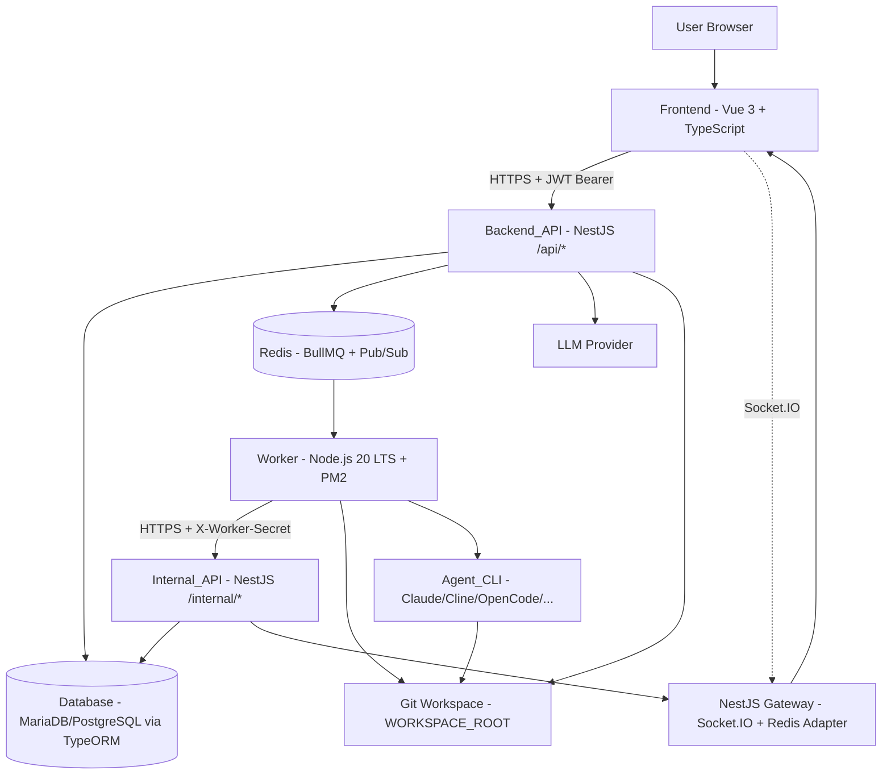
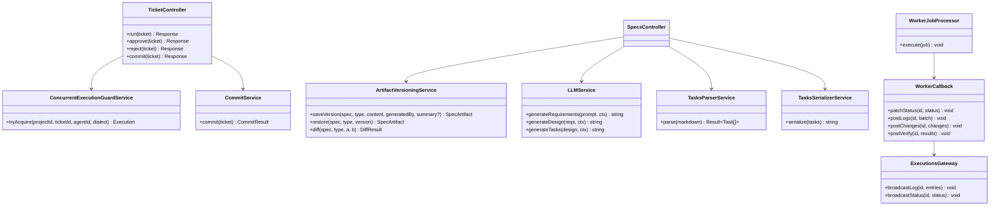
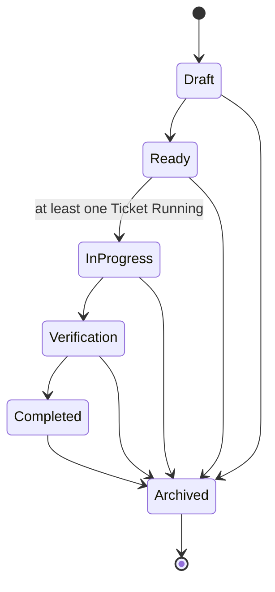
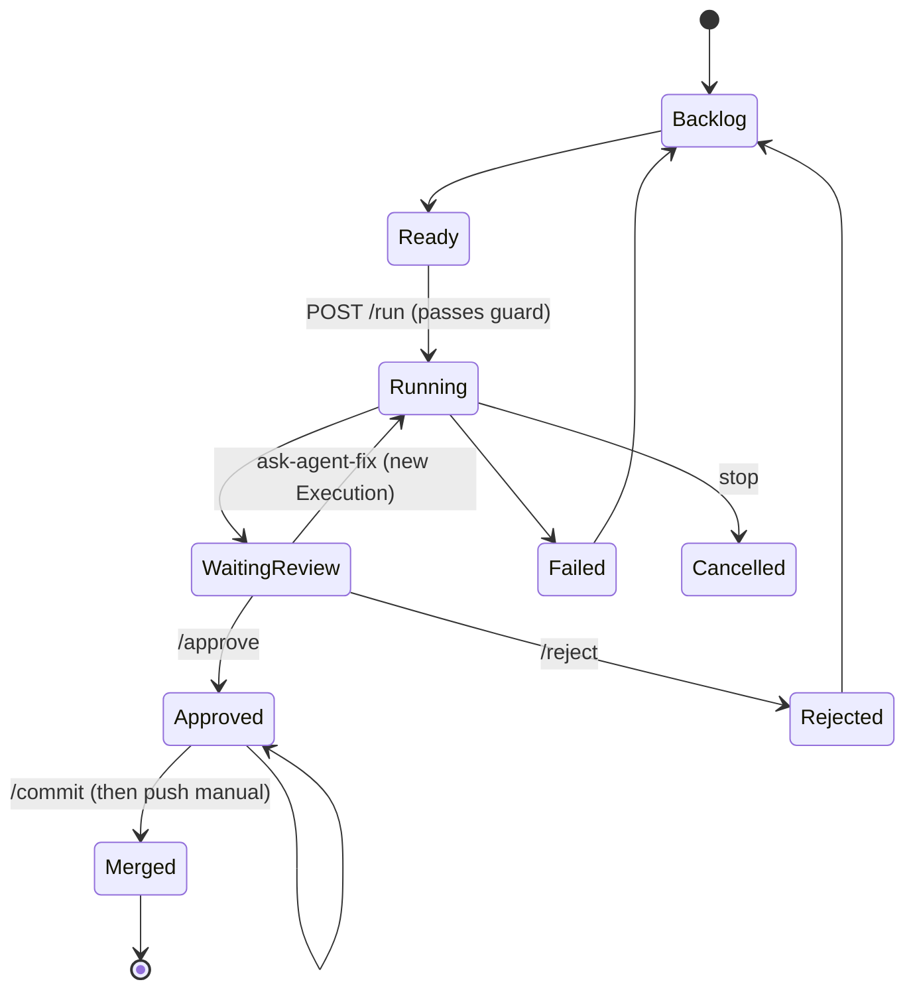
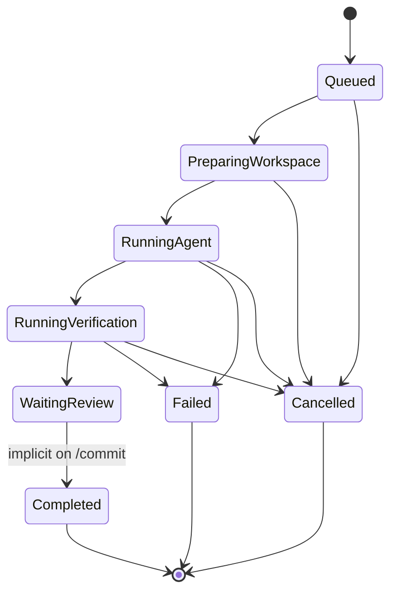

# Design Document

## Overview

SpecPilot adalah *orchestration layer* berbasis web yang mengimplementasikan alur **Intent → Requirements → Design → Tasks → Execution → Verification → Review → Commit/PR**. Dokumen ini merancang arsitektur MVP yang memenuhi 24 requirement pada `requirements.md`, dengan menjaga tiga prinsip arsitektur utama dari PRD v2.0:

1. **Separation of concerns** antara Frontend (Vue 3), Backend_API (NestJS), Internal_API (NestJS dengan guard `X-Worker-Secret`), Worker (Node.js 20 LTS), Database, dan Redis_Queue. Worker tidak pernah mengakses Database secara langsung — seluruh persistensi dilakukan via Internal_API yang diamankan dengan `X-Worker-Secret`.
2. **Append-only artifact versioning** sebagai sumber kebenaran riwayat Spec. Tidak ada `UPDATE` pada kolom `content` baris `spec_artifacts` — setiap perubahan menghasilkan baris baru.
3. **Single active execution per Project**. Concurrent execution guard di-enforce di Backend_API saat enqueue, bukan di Worker, agar invarian `≤ 1 Active_Execution per Project` selalu dapat diverifikasi pada lapisan transaksional Database.

Sasaran desain berikut menerjemahkan requirement menjadi keputusan teknis yang dapat dieksekusi:

- Memetakan setiap endpoint publik (`/api/*`) dan internal (`/internal/*`) ke modul NestJS yang jelas tanggung jawabnya.
- Mendefinisikan kontrak data Tasks markdown ↔ Task struct sebagai fungsi murni di paket bersama (`@specpilot/shared`), sehingga round-trip property dapat dibuktikan dengan property-based testing dan dipakai bersama oleh Backend_API dan Worker.
- Mendefinisikan transisi state Ticket dan Execution sebagai mesin status eksplisit dengan invarian yang dapat diverifikasi.
- Menjamin Workspace isolation per Execution melalui Git worktree, dengan path deterministik berbasis `project_id` dan `ticket_id`.
- Menjamin redaction `WORKER_SECRET` dan API key Agent pada seluruh log dan response melalui Pino redaction + `RedactSensitiveInterceptor` tersentralisasi.
- Mendukung deployment pada Linux, macOS, dan Windows 10/11 + Server 2019/2022 dengan abstraksi proses, path, dan service-management cross-OS (lihat bagian Cross-Platform & Windows Compatibility).

Stack target seluruhnya berbasis Node.js: Vue 3 + TypeScript untuk Frontend; NestJS + TypeScript + TypeORM di Node.js 20 LTS untuk Backend_API/Internal_API/WebSocket Gateway; Node.js 20 LTS + BullMQ + PM2 untuk Worker; MariaDB atau PostgreSQL untuk Database (driver `mariadb` / `pg`); Redis untuk antrian dan pub/sub. Repositori dikelola sebagai monorepo pnpm dengan paket `apps/api`, `apps/worker`, `apps/web`, dan `packages/shared`.

Dokumen ini tidak mendefinisikan UI visual final (warna, spacing, typography). UI section di sini fokus pada struktur halaman, route, kontrak data komponen, dan keputusan arsitektur Frontend yang relevan terhadap requirement.

## Architecture

### High-Level Architecture



### Layered Decomposition

| Layer | Komponen | Tanggung Jawab Utama |
|---|---|---|
| Frontend | Vue 3 SPA, Pinia stores, Vue Router, Monaco Editor, xterm.js, Mermaid.js | Render UI (Req 23), subscribe Socket.IO log realtime (Req 16), masking API key (Req 21.6/21.7), redirect login (Req 23.2) |
| Backend_API (publik) | NestJS modules, controllers `/api/*`, `JwtAuthGuard` (Passport.js strategy `jwt`), pipes, interceptors | Auth (Req 2), Project CRUD (Req 1), Spec CRUD (Req 4), generate artifact (Req 5–7), Ticket (Req 10), run/stop (Req 11, 15), approve/reject/commit (Req 18, 20), verify trigger (Req 19), Agent settings (Req 21), Phase 2 rejection (Req 24) |
| Internal_API | NestJS controllers di `/internal/*` dengan `WorkerSecretGuard` (timing-safe equal) | Worker callback: status, logs, changes, verify-result (Req 13, 16, 17, 19) |
| WebSocket | NestJS Gateway (`@nestjs/websockets`) berbasis Socket.IO + `@socket.io/redis-adapter` | Broadcast log/status realtime ke channel `execution.{id}` (Req 16) |
| Domain services | `LLMService`, `ArtifactVersioningService`, `TasksParserService`, `TasksSerializerService`, `ConcurrentExecutionGuardService`, `CommitService`, `Phase2RejectService`, `ProjectGitLockService` | Business logic terisolasi sebagai NestJS `@Injectable()`, mudah di-unit-test |
| Shared | `packages/shared` (TypeScript pure functions): `parseTasks`, `serializeTasks`, tipe `Task`, EARS validator, line-based diff | Dipakai bersama oleh `apps/api` dan `apps/worker` agar round-trip property Req 8.6/8.7 berlaku end-to-end |
| Queue | Redis + BullMQ | Job transport antara Backend_API (producer) dan Worker (consumer) (Req 11, 13) |
| Worker | Node.js 20, BullMQ consumer, PM2 | Workspace isolation (Req 12), Agent lifecycle (Req 13, 14), stop signal (Req 15), verification (Req 19), allowlist (Req 22) — TIDAK BERUBAH dari design lama secara konseptual |
| Database | MariaDB / PostgreSQL via TypeORM | Persistensi Project, Spec, Artifact_Version, Task, Ticket, Execution, Logs, File_Change, Verification_Result, Agent |

### Process & Deployment Topology

- **Backend_API** dan **Internal_API** dijalankan dalam **satu NestJS app** (`apps/api`). Pemisahan dilakukan oleh module + route prefix + guard, bukan oleh proses berbeda:
  - `/api/*` controllers berada di module-module publik (AuthModule, ProjectsModule, dst) dan dilindungi oleh `JwtAuthGuard` (kecuali `POST /api/auth/login` dan `POST /api/auth/register` yang menggunakan `@Public()` decorator).
  - `/internal/*` controllers berada di `InternalModule` dan dilindungi oleh `WorkerSecretGuard`. `JwtAuthGuard` tidak terpasang pada route ini; bahkan kehadiran header `Authorization: Bearer` atau cookie session menyebabkan reject 401 (Req 13.8).
- **WebSocket Gateway** dijalankan di proses NestJS yang sama (default) menggunakan Socket.IO + `@socket.io/redis-adapter` agar broadcast tetap konsisten ketika di kemudian hari NestJS app discale-out menjadi beberapa instance. Jika beban WS tinggi, gateway dapat di-spin-off ke proses terpisah dengan cara mengonsumsi `RedisIoAdapter` yang sama; tidak perlu mengubah kontrak frontend.
- **Worker** dijalankan oleh PM2 sebagai proses terpisah (`apps/worker`) dengan `instances: 1` dan `concurrency: 1` di BullMQ. Single-instance worker disengaja: enforcement concurrency utama berada di Backend_API saat enqueue, sedangkan worker concurrency 1 menjadi defense-in-depth. Pada Windows, PM2 dibungkus oleh `pm2-windows-service` atau NSSM agar autostart saat boot (lihat bagian Cross-Platform & Windows Compatibility).
- **Redis** menampung queue BullMQ, channel pub/sub `execution-stop:{id}`, login throttle storage, project git lock, denylist JWT logout, dan adapter Socket.IO. Pada Windows, Redis disediakan oleh Memurai (drop-in compatible) atau Redis di WSL2/Docker.

### Request Flow: Run Ticket (end-to-end)

```mermaid
sequenceDiagram
    participant U as User
    participant FE as Frontend
    participant API as Backend_API (NestJS)
    participant DB as Database
    participant Q as Redis/BullMQ
    participant W as Worker
    participant INT as Internal_API (NestJS)
    participant WS as WebSocket Gateway
    participant CLI as Agent_CLI

    U->>FE: Klik "Run"
    FE->>API: POST /api/tickets/{id}/run (JWT Bearer)
    API->>DB: BEGIN TX; SELECT ... FOR UPDATE (Active_Execution check)
    alt Sudah ada Active_Execution
        API-->>FE: 409 "Ada execution aktif untuk project ini..."
    else Belum ada
        API->>DB: INSERT executions (status=Queued)
        API->>Q: BullMQ add() (producer)
        API->>DB: COMMIT
        API-->>FE: 202 { execution_id }
    end
    Q-->>W: deliver job
    W->>INT: PATCH /internal/executions/{id} status=Preparing Workspace
    INT->>WS: emit execution.{id}
    W->>W: git worktree add ...
    W->>INT: PATCH status=Running Agent
    W->>CLI: spawn (execa, allowlisted)
    loop streaming
        CLI-->>W: stdout chunk
        W->>INT: POST /internal/executions/{id}/logs (batch ≤500ms)
        INT->>WS: emit log entries
    end
    CLI-->>W: exit
    W->>W: git status / git diff
    W->>INT: POST /internal/executions/{id}/changes
    W->>W: run verification commands
    W->>INT: POST /internal/executions/{id}/verify-result
    W->>INT: PATCH status=Waiting Review
    W->>W: cleanup worktree
```

### Concurrent Execution Guard Strategy

Requirement 11 menetapkan invarian: untuk setiap Project P, jumlah Execution dengan status ∈ {Queued, Preparing Workspace, Running Agent, Running Verification} harus ≤ 1. Invarian ini diberlakukan dengan dua mekanisme komplementer:

1. **Row-level lock saat enqueue** (Req 11.1, 11.7, 11.8). Dalam transaksi TypeORM, Backend_API mengeksekusi `SELECT id FROM executions WHERE project_id = ? AND status IN ('Queued','Preparing Workspace','Running Agent','Running Verification') FOR UPDATE` dengan timeout akuisisi 5 detik. Jika baris ditemukan → 409. Jika timeout akuisisi lock → 503. Jika tidak ditemukan → INSERT baru lalu enqueue lalu COMMIT. Push ke BullMQ dilakukan setelah INSERT tetapi sebelum COMMIT untuk menjaga atomicity dengan sedikit nuansa: jika push gagal sebelum COMMIT, transaksi di-rollback (Req 11.4); jika push berhasil tetapi COMMIT gagal, kompensasi mark Execution Failed (Req 11.5).
2. **Partial unique index defense-in-depth**.
   - **PostgreSQL**: `CREATE UNIQUE INDEX uniq_active_execution_per_project ON executions (project_id) WHERE status IN ('Queued','Preparing Workspace','Running Agent','Running Verification')`.
   - **MariaDB** (yang tidak mendukung partial unique index secara native): generated column `is_active TINYINT(1) AS (CASE WHEN status IN ('Queued','Preparing Workspace','Running Agent','Running Verification') THEN 1 ELSE NULL END) STORED` plus `UNIQUE INDEX uniq_active_execution_per_project (project_id, is_active)`. Karena `is_active` bernilai `NULL` untuk baris non-aktif, dan unique index MariaDB mengizinkan banyak `NULL`, hanya satu baris aktif per `project_id` yang dapat lolos.

#### TypeORM Implementation (NestJS)

```ts
// apps/api/src/modules/tickets/concurrent-execution-guard.service.ts
@Injectable()
export class ConcurrentExecutionGuardService {
  constructor(
    @InjectDataSource() private readonly dataSource: DataSource,
    @InjectQueue('execution') private readonly executionQueue: Queue,
  ) {}

  async tryAcquire(projectId: number, ticketId: number, agentId: number, dialect: 'postgres' | 'mariadb') {
    return this.dataSource.transaction(async (manager) => {
      // Set per-transaction lock-wait timeout (Req 11.7)
      if (dialect === 'postgres') {
        await manager.query(`SET LOCAL lock_timeout = '5s'`);
      } else {
        await manager.query(`SET innodb_lock_wait_timeout = 5`);
      }

      // 1. SELECT FOR UPDATE active execution (Req 11.1)
      const active = await manager
        .createQueryBuilder(Execution, 'e')
        .setLock('pessimistic_write')
        .where('e.project_id = :projectId', { projectId })
        .andWhere('e.status IN (:...statuses)', {
          statuses: ['Queued', 'Preparing Workspace', 'Running Agent', 'Running Verification'],
        })
        .getOne();

      if (active) {
        throw new ConflictException(
          'Ada execution aktif untuk project ini. Tunggu hingga selesai atau hentikan execution sebelumnya.',
        ); // Req 11.2
      }

      // 2. INSERT new Execution (Req 11.3)
      const execution = manager.create(Execution, {
        ticketId,
        projectId,
        agentId,
        status: 'Queued',
      });
      const saved = await manager.save(execution);

      // 3. Enqueue BullMQ job before COMMIT (Req 11.3, 11.4)
      try {
        await this.executionQueue.add('execute', { executionId: saved.id }, { attempts: 2 });
      } catch (err) {
        // Push failed → transaction rollback (Req 11.4)
        throw new BadGatewayException('Failed to enqueue job; transaction rolled back');
      }

      return saved;
    });
    // 4. If COMMIT itself throws (Req 11.5), the caller compensates by marking the
    //    just-inserted Execution Failed (best-effort) and returning 502.
  }
}
```

Caller di `TicketsController.run()` memetakan:
- Sukses → `HttpStatus.ACCEPTED` (202).
- `ConflictException` (active exists) → 409.
- `QueryFailedError` dengan code `55P03` (PostgreSQL `lock_not_available`) atau `1205` (MariaDB lock wait timeout) → diterjemahkan ke `LockTimeoutException extends ServiceUnavailableException` (503) oleh global exception filter (Req 11.8).
- `BadGatewayException` (BullMQ enqueue gagal post-INSERT/COMMIT) → 502, dan `ConcurrentExecutionGuardService` melakukan kompensasi `UPDATE executions SET status='Failed', error_message='Enqueue failed' WHERE id = <saved.id>` agar tidak ada baris `Queued` tanpa job (Req 11.5).

### Append-only Versioning Strategy

Requirement 9 dan 5/6/7 menetapkan bahwa setiap perubahan Artifact menghasilkan baris baru di `spec_artifacts`. Aturan operasional:

- Setiap penyimpanan dijalankan dalam satu transaksi Database (Req 9.2).
- Pemeriksaan unik `is_current = true` per `(spec_id, type)` ditegakkan oleh partial unique index yang sama bentuknya dengan execution guard (Req 9.3).
- Versi nomor di-derive dari `MAX(version)+1` dalam transaksi yang sama dengan SELECT FOR UPDATE pada baris is_current saat ini (Req 9.4).
- `parent_id` selalu menunjuk ke baris yang baru saja di-set `is_current = false` (Req 9.5).
- Pruning kelebihan versi (Req 9.6, 9.12): setelah INSERT, hitung jumlah baris untuk `(spec_id, type)`. Jika > 50, hapus baris paling lama dengan `is_current = false`. Saat memilih baris yang dihapus, pilih dengan urutan: (a) **prioritaskan** baris dengan `generated_by = 'llm'` paling lama; (b) hanya hapus baris `generated_by = 'user'` jika seluruh baris lain sudah versi LLM atau jumlah masih > 50. Aturan (a) memenuhi Req 9.12 ("regenerate LLM tidak menimpa versi user").
- Restore (Req 9.8) adalah INSERT baru dengan `content` byte-for-byte identik dari versi sumber, `generated_by = 'user'`, `change_summary = "Restored from version {version}"`, lalu pruning seperti di atas.

#### TypeORM Implementation (NestJS)

```ts
// apps/api/src/modules/artifact-versions/artifact-versioning.service.ts
@Injectable()
export class ArtifactVersioningService {
  constructor(@InjectDataSource() private readonly dataSource: DataSource) {}

  async saveVersion(
    spec: Spec,
    type: ArtifactType,
    content: string,
    generatedBy: 'llm' | 'user',
    changeSummary?: string,
    createdBy?: number,
  ): Promise<SpecArtifact> {
    if (!['llm', 'user'].includes(generatedBy)) {
      throw new BadRequestException('generated_by harus llm atau user'); // Req 9.7
    }

    return this.dataSource.transaction(async (manager) => {
      // 1. Lock current version (Req 9.2, 9.4)
      const current = await manager
        .createQueryBuilder(SpecArtifact, 'a')
        .setLock('pessimistic_write')
        .where('a.spec_id = :specId', { specId: spec.id })
        .andWhere('a.type = :type', { type })
        .andWhere('a.is_current = :flag', { flag: true })
        .getOne();

      const newVersion = (current?.version ?? 0) + 1;

      // 2. Demote current (Req 9.2)
      if (current) {
        await manager.update(SpecArtifact, { id: current.id }, { isCurrent: false });
      }

      // 3. Insert new row (Req 9.4, 9.5)
      const row = manager.create(SpecArtifact, {
        specId: spec.id,
        type,
        content,
        version: newVersion,
        parentId: current?.id ?? null,
        isCurrent: true,
        generatedBy,
        changeSummary,
        createdBy,
      });
      const saved = await manager.save(row);

      // 4. Prune (Req 9.6, 9.12)
      await this.pruneIfNeeded(manager, spec.id, type);

      return saved;
    });
  }

  private async pruneIfNeeded(manager: EntityManager, specId: number, type: ArtifactType) {
    const total = await manager.count(SpecArtifact, { where: { specId, type } });
    if (total <= 50) return;

    let toRemove = total - 50;
    // First pass: oldest LLM versions (Req 9.12 LLM-first)
    const llmRows = await manager.find(SpecArtifact, {
      where: { specId, type, isCurrent: false, generatedBy: 'llm' },
      order: { version: 'ASC' },
      take: toRemove,
    });
    if (llmRows.length) {
      await manager.delete(SpecArtifact, llmRows.map(r => r.id));
      toRemove -= llmRows.length;
    }
    // Second pass: only if still over budget, prune user rows (never is_current = true; Req 9.6)
    if (toRemove > 0) {
      const userRows = await manager.find(SpecArtifact, {
        where: { specId, type, isCurrent: false, generatedBy: 'user' },
        order: { version: 'ASC' },
        take: toRemove,
      });
      if (userRows.length) await manager.delete(SpecArtifact, userRows.map(r => r.id));
    }
  }

  async restore(spec: Spec, type: ArtifactType, version: number, userId: number) {
    const source = await this.dataSource
      .getRepository(SpecArtifact)
      .findOne({ where: { specId: spec.id, type, version } });
    if (!source) throw new NotFoundException('Versi tidak ditemukan'); // Req 9.9
    return this.saveVersion(spec, type, source.content, 'user', `Restored from version ${version}`, userId); // Req 9.8
  }
}
```

### Worker Lifecycle Architecture

Worker mengikuti lifecycle 13 langkah pada PRD bagian 8.4 dan **tidak berubah** dari design lama secara konseptual. Pada level desain, Worker dipecah menjadi modul:

- `index.ts` — entry point BullMQ consumer dengan `concurrency: 1`, attach signal handler `SIGTERM`/`SIGINT` untuk graceful shutdown.
- `jobs/execute.ts` — orchestrator lifecycle (status transitions, error handling, retry policy).
- `services/git.ts` — wrapper `simple-git` untuk `worktree add/remove`, `status`, `diff`, dengan timeout per operasi.
- `services/agent.ts` — spawn Agent_CLI via `execa` dengan timeout (Req 14), signal handling (Req 14.3–14.5, 15.3–15.4), stdout streaming.
- `services/sandbox.ts` — allowlist enforcement (Req 22.1–22.3, 22.5–22.6), pengecekan root/Administrator (Req 22.4).
- `services/process.ts` — abstraksi cross-OS untuk `killTree(child, { graceMs })` (POSIX process group + SIGTERM/SIGKILL pada Linux/macOS, `taskkill /T` lalu `taskkill /T /F` pada Windows). Dipakai oleh `services/agent.ts` untuk memenuhi Req 14.3–14.5 dan Req 15.3–15.4 secara seragam di semua platform.
- `services/callback.ts` — HTTP client `undici` ke Internal_API NestJS dengan exponential backoff (Req 13.12, 14.7).
- `utils/logger.ts` — `pino` dengan redaction untuk `WORKER_SECRET` dan API key.
- `utils/timeout.ts` — helper `setTimeout`/`AbortController` untuk per-operasi timeout.
- `config.ts` — load `dotenv`, validasi konfigurasi (allowlist, secret, backend URL) memakai schema Zod, exit on invalid config.

Worker tidak menggunakan NestJS di runtime-nya (proses terpisah, tidak butuh DI container atau HTTP). Worker meng-`import { parseTasks, serializeTasks, type Task } from '@specpilot/shared'` untuk validasi konten Tasks ketika perlu (mis. saat memproses prompt "Ask Agent to Fix"). Paket bersama menjamin Tasks_Parser/Tasks_Serializer Backend_API dan Worker memakai grammar yang sama, sehingga round-trip property Req 8.6/8.7 berlaku end-to-end.

## Components and Interfaces

### Frontend Components (Vue 3 + TypeScript)

> Bagian ini **tidak berubah** dari design lama. Frontend tetap Vue 3 + TypeScript.

#### Routing & Pages

Route map (Req 23.1):

| Route | Komponen Page | Auth Guard |
|---|---|---|
| `/login` | `LoginPage.vue` | guest |
| `/` | `DashboardPage.vue` | auth |
| `/projects` | `ProjectListPage.vue` | auth |
| `/projects/:projectId` | `ProjectDetailPage.vue` | auth + project owner |
| `/projects/:projectId/specs/:specId/requirements` | `SpecRequirementsPage.vue` | auth |
| `/projects/:projectId/specs/:specId/design` | `SpecDesignPage.vue` | auth |
| `/projects/:projectId/specs/:specId/tasks` | `SpecTasksPage.vue` | auth |
| `/projects/:projectId/specs/:specId/artifacts/:type/versions` | `ArtifactVersionHistoryPage.vue` | auth |
| `/tickets/:ticketId` | `TicketDetailPage.vue` | auth |
| `/executions/:executionId` | `ExecutionDetailPage.vue` | auth |
| `/executions/:executionId/diff` | `DiffReviewPage.vue` | auth |
| `/settings/agents` | `AgentSettingsPage.vue` | auth |
| `/settings/repository` | `RepositorySettingsPage.vue` | auth |
| `/settings/user` | `UserSettingsPage.vue` | auth |
| `/spec-graph/*`, `/hooks/*` | **tidak ada route** (Req 23.5–23.6, Req 24.1) | — 404 |

Route guard di `router.beforeEach` memeriksa `useAuthStore().isAuthenticated`. Jika tidak authenticated dan target ≠ `/login`, redirect ke `/login` (Req 23.2). Untuk MVP build, `import.meta.glob` tidak menyertakan `/spec-graph/*` dan `/hooks/*` sehingga bundle tidak memuat kode-nya (Req 23.5).

#### Layout & State

`AppLayout.vue` menyusun: top bar (`TopBar.vue` dengan project switcher, branch indicator, status, search, user menu), left sidebar (`SideNav.vue`), main workspace (router-view), right panel (`ContextPanel.vue`), bottom panel (`LogPanel.vue` — collapsible). Tema dark default diaktifkan oleh `useThemeStore().init()` yang dipanggil di `main.ts` sebelum mount, untuk menghindari flash terang (Req 23.4).

Pinia stores:

- `useAuthStore` — JWT token (localStorage), current User, login/logout. Saat `logout()` dipanggil, token disertakan di `POST /api/auth/logout` agar Backend_API mendaftarkan ke denylist Redis.
- `useProjectStore` — daftar project, project aktif.
- `useSpecStore` — Spec list per project, Spec aktif, tiga Artifact aktif (requirements/design/tasks).
- `useArtifactVersionStore` — versions list per `(spec, type)`, diff cache.
- `useTicketStore` — tickets list per project, ticket aktif.
- `useExecutionStore` — execution aktif, log entries (ring buffer 5000 entries), file changes, verification results.
- `useAgentStore` — daftar Agent.
- `useThemeStore` — tema preference.

#### Realtime Subscription

`ExecutionDetailPage.vue` menggunakan composable `useExecutionStream(executionId)` yang membuka koneksi Socket.IO ke namespace `/executions` dan memanggil `socket.emit('subscribe', { executionId })` lalu mendengarkan event `log` dan `status` di channel `execution.{id}` (Req 16.3). Mekanisme reconnect: Socket.IO bawaan diatur dengan `reconnection: true, reconnectionDelay: 2000, reconnectionAttempts: 5` (Req 16.4). Indicator status koneksi ditampilkan dengan warna pada header panel.

#### API Key Masking Component

`AgentApiKeyField.vue` props: `apiKey: string`. Logika render: jika `apiKey.length >= 4`, tampilkan `'•'.repeat(apiKey.length - 4) + apiKey.slice(-4)` (Req 21.6). Jika `apiKey.length < 4`, tampilkan `'•'.repeat(apiKey.length)` (Req 21.7). Field input untuk edit selalu dimulai kosong dengan placeholder `Enter to update`; submit kosong = tidak mengubah API key.

#### Diff Viewer

`DiffReviewPage.vue` me-render daftar `FileChangeRow.vue` (filterable per change_type, Req 17.6) dan ketika file dipilih membuka `DiffPane.vue`. Syntax highlighting pakai Shiki/Prism dengan resolver ekstensi → bahasa (Req 17.5). Ekstensi tidak dikenal jatuh ke plain text. Setiap row punya tombol mark `pending|reviewed|approved|rejected` yang memanggil `PUT /api/file-changes/{id}` (Req 17.7).


### Backend_API Components (NestJS)

#### Modules

NestJS backend tersusun dari modul-modul berikut (`apps/api/src/modules/`):

| Module | Tanggung Jawab | Requirement |
|---|---|---|
| `AuthModule` | Login/logout/register, Passport JWT strategy, denylist Redis, login throttler | Req 2 |
| `ProjectsModule` | CRUD Project, clone/sync, ProjectGitLockService | Req 1, 3 |
| `SpecsModule` | CRUD Spec, generate-requirements/design/tasks (memanggil LLMService) | Req 4, 5, 6, 7 |
| `ArtifactVersionsModule` | List/get versions, restore, diff | Req 9 |
| `TicketsModule` | CRUD Ticket, run/approve/reject/commit/ask-agent-fix | Req 10, 11, 18, 20 |
| `ExecutionsModule` | List/get Execution, stop, logs, changes, verify trigger | Req 15, 16, 17, 19 |
| `FileChangesModule` | Update review_status | Req 17.7 |
| `AgentsModule` | CRUD Agent, default agent uniqueness | Req 21 |
| `Phase2RejectModule` | Catch-all controller untuk identifier Phase 2; menulis audit log | Req 24 |
| `InternalModule` | Controllers `/internal/*` dengan `WorkerSecretGuard` | Req 13, 16, 17, 19 |
| `WebsocketModule` | NestJS Gateway Socket.IO + Redis adapter, namespace `/executions` | Req 16 |
| `LlmModule` | `LLMService` (provider HTTP client + prompt template + validator) | Req 5, 6, 7 |

Bootstrap di `main.ts` mengaktifkan helmet, CORS (origin = Frontend), `ValidationPipe` global, `RedactSensitiveInterceptor` global, `AllExceptionsFilter` global, dan menggantikan default Logger dengan Pino (`nestjs-pino`).

#### Controllers per Requirement

| Controller | Endpoint | Module | Requirement |
|---|---|---|---|
| `AuthController` | `POST /api/auth/login`, `POST /api/auth/logout`, `POST /api/auth/register` | AuthModule | Req 2 |
| `ProjectsController` | `GET/POST /api/projects`, `GET/PUT/DELETE /api/projects/{project}`, `POST /api/projects/{project}/clone`, `POST /api/projects/{project}/sync` | ProjectsModule | Req 1, 3 |
| `SpecsController` | `GET/POST /api/projects/{project}/specs`, `GET/PUT/DELETE /api/specs/{spec}`, `POST /api/specs/{spec}/generate-requirements`, `POST /api/specs/{spec}/generate-design`, `POST /api/specs/{spec}/generate-tasks` | SpecsModule | Req 4, 5, 6, 7 |
| `ArtifactVersionsController` | `GET /api/specs/{spec}/artifacts/{type}/versions`, `GET /api/specs/{spec}/artifacts/{type}/versions/{version}`, `POST /api/specs/{spec}/artifacts/{type}/versions/{version}/restore`, `GET /api/specs/{spec}/artifacts/{type}/versions/{a}/diff/{b}` | ArtifactVersionsModule | Req 9 |
| `TicketsController` | `GET /api/projects/{project}/tickets`, `POST /api/specs/{spec}/tickets`, `GET/PUT /api/tickets/{ticket}`, `POST /api/tickets/{ticket}/run`, `POST /api/tickets/{ticket}/approve`, `POST /api/tickets/{ticket}/reject`, `POST /api/tickets/{ticket}/commit`, `POST /api/tickets/{ticket}/ask-agent-fix` | TicketsModule | Req 10, 11, 18, 20 |
| `ExecutionsController` | `GET /api/tickets/{ticket}/executions`, `GET /api/executions/{execution}`, `POST /api/executions/{execution}/stop`, `GET /api/executions/{execution}/logs`, `GET /api/executions/{execution}/changes`, `POST /api/executions/{execution}/verify` | ExecutionsModule | Req 15, 16, 17, 19 |
| `FileChangesController` | `PUT /api/file-changes/{id}` | FileChangesModule | Req 17.7 |
| `AgentsController` | `GET/POST /api/agents`, `GET/PUT/DELETE /api/agents/{agent}` | AgentsModule | Req 21 |
| `Phase2RejectController` | catch-all + body sniffer untuk identifier Phase 2 | Phase2RejectModule | Req 24 |
| `WorkerExecutionController` | `PATCH /internal/executions/{id}`, `POST /internal/executions/{id}/logs`, `POST /internal/executions/{id}/changes`, `POST /internal/executions/{id}/verify-result` | InternalModule | Req 13, 16, 17, 19 |
| `ExecutionsGateway` | Socket.IO namespace `/executions`; events `subscribe`, `log`, `status` | WebsocketModule | Req 16 |

#### Guards

- **`JwtAuthGuard`** (terdaftar global via `APP_GUARD` di `AppModule`) — Passport `jwt` strategy. Memvalidasi token dari header `Authorization: Bearer <token>`, men-decode payload `{ sub: userId, jti, exp }`, lalu memeriksa denylist Redis (`SISMEMBER auth:denylist`). Jika `jti` ada di denylist atau token expired/invalid → `UnauthorizedException`. Decorator `@Public()` (custom) memarkir handler `login`/`register` agar guard di-skip via `Reflector`.
- **`WorkerSecretGuard`** — terpasang **hanya** pada `InternalModule`. Implementasi:
  ```ts
  @Injectable()
  export class WorkerSecretGuard implements CanActivate {
    constructor(private readonly cfg: ConfigService) {}
    canActivate(ctx: ExecutionContext): boolean {
      const req = ctx.switchToHttp().getRequest<Request>();
      const provided = req.header('x-worker-secret') ?? '';
      const expected = this.cfg.getOrThrow<string>('WORKER_SECRET');
      const a = Buffer.from(provided, 'utf8');
      const b = Buffer.from(expected, 'utf8');
      const ok = a.length === b.length && crypto.timingSafeEqual(a, b); // Req 13.7
      if (!ok) throw new UnauthorizedException();
      // Reject if request also carries Authorization or session cookie (Req 13.8)
      if (req.header('authorization') || req.header('cookie')?.match(/connect\.sid|specpilot_session/)) {
        throw new UnauthorizedException();
      }
      return true;
    }
  }
  ```
  `JwtAuthGuard` global tidak terpasang pada handler `InternalModule` karena modul tersebut dideklarasikan dengan `@UseGuards(WorkerSecretGuard)` dan handler-nya menggunakan `@Public()` agar global JWT guard di-skip. Hasil bersihnya: `/internal/*` hanya dapat diakses dengan header worker secret yang valid dan tanpa kredensial user.
- **`ProjectOwnerGuard`** — memuat `Project` berdasarkan `:projectId` dari route param, lalu memastikan `project.user_id === req.user.sub`. Diaktifkan dengan `@UseGuards(JwtAuthGuard, ProjectOwnerGuard)` pada controller `Projects`, `Specs`, `Tickets` (untuk endpoint yang menerima `:projectId` atau Ticket yang dimiliki Project user) (Req 1.6, 4.7, 10.6).
- **`LoginThrottleGuard`** — extends `ThrottlerGuard` dari `@nestjs/throttler`, override `getTracker()` agar mengembalikan `req.body.email`. Custom `RedisThrottlerStorage` dipakai agar batas 5/menit dan blokir 5 menit konsisten lintas instance (Req 2.3). Dipasang di `AuthController.login()` saja.

#### Interceptors

- **`RedactSensitiveInterceptor`** (global) — meng-intercept response body dan header sebelum dikirim. Ia menerima daftar pola dari `ConfigService` (`WORKER_SECRET`, dan setiap `agent.config_json.api_key` yang sedang di-load dalam request scope) dan mengganti substring yang cocok dengan `[REDACTED]`. Selain itu, secara struktural ia membersihkan field `config_json.api_key` dari serialized Agent menjadi versi mask (4 karakter terakhir) sebelum response dikirim, melengkapi mask di Frontend (Req 21.6–21.8). Interceptor juga digunakan untuk pesan error dari Git stderr setelah melalui `GitStderrSanitizer` (Req 3.5, 20.6).

#### Pipes

`ValidationPipe` global dikonfigurasi:

```ts
app.useGlobalPipes(new ValidationPipe({
  whitelist: true,
  forbidNonWhitelisted: true,  // unknown fields → 400
  transform: true,
  transformOptions: { enableImplicitConversion: true },
  errorHttpStatusCode: 422,    // Req 1.2, 4.6 default
}));
```

Beberapa controller (mis. `auth.login`, `agents.create`, `file-changes`) menggunakan decorator `@HttpCode(...)` atau `@UsePipes(new ValidationPipe({ errorHttpStatusCode: 400 }))` untuk requirement yang menuntut 400 alih-alih 422 (mis. Req 5.5, 17.2, 21.2).

DTO contoh:

```ts
// modules/projects/dto/create-project.dto.ts
export class CreateProjectDto {
  @IsString() @Length(1, 120) name!: string;
  @IsOptional() @IsString() @Length(0, 2000) description?: string;
  @IsString() @Length(1, 500) @Matches(/^(https?:\/\/|ssh:\/\/|git@)/) repository_url!: string;
  @IsString() @Length(1, 100) default_branch!: string;
  @IsOptional() @IsObject() stack?: Record<string, unknown>;
  @IsOptional() @IsString() @Length(0, 500) root_path?: string;
  @IsOptional() @IsString() @Length(0, 2000) test_command?: string;
  @IsOptional() @IsString() @Length(0, 2000) lint_command?: string;
  @IsOptional() @IsString() @Length(0, 2000) build_command?: string;
  @IsOptional() @IsInt() default_agent_id?: number;
}

// modules/auth/dto/login.dto.ts
export class LoginDto {
  @IsEmail() @Length(1, 254) email!: string;
  @IsString() @Length(8, 128) password!: string;
}

// modules/specs/dto/generate-requirements.dto.ts
export class GenerateRequirementsDto {
  @IsString() @Length(1, 10000) prompt!: string;  // Req 5.5 (kosong/>10000 → 400)
}

// modules/agents/dto/create-agent.dto.ts
const ALLOWED_PROVIDERS = ['openai_compatible','omniroute','anthropic','gemini','ollama_local','custom_endpoint'] as const;
export class AgentConfigJsonDto {
  @IsString() @Length(1, 4096) api_key!: string;
  @IsInt() @Min(1) @Max(600) timeout_seconds!: number;        // Req 21.5
  @IsArray() @ArrayMaxSize(100) @IsString({ each: true }) allowed_commands!: string[];
}
export class CreateAgentDto {
  @IsString() @Length(1, 100) name!: string;
  @IsString() @Length(1, 50) type!: string;
  @IsIn(ALLOWED_PROVIDERS as unknown as string[]) provider!: string; // Req 21.3, 21.4
  @IsString() @Length(1, 200) model!: string;
  @IsOptional() @IsString() @Length(0, 500) base_url?: string;
  @ValidateNested() @Type(() => AgentConfigJsonDto) config_json!: AgentConfigJsonDto;
  @IsOptional() @IsBoolean() is_default?: boolean;
}

// modules/tickets/dto/ask-agent-fix.dto.ts
export class ReviewCommentDto {
  @IsString() @Length(1, 4000) text!: string;                  // Req 18.5 (1-4000 char per entri)
}
export class AskAgentFixDto {
  @IsArray() @ArrayMinSize(1) @ArrayMaxSize(50)                // Req 18.5 (1-50 entri)
  @ValidateNested({ each: true }) @Type(() => ReviewCommentDto)
  comments!: ReviewCommentDto[];
}
```

`AskAgentFixDto` di-bind di `TicketsController.askAgentFix(@Body() dto: AskAgentFixDto)` dengan `@UsePipes(new ValidationPipe({ errorHttpStatusCode: 400 }))` agar payload yang melanggar batasan jumlah/panjang ditolak 400 sebelum service domain dipanggil — invarian Property 11 (validation no side-effects) tetap berlaku karena tidak ada Execution baru yang dibuat (Req 18.6).

Untuk skenario di mana DTO tidak menangkap shared types dari paket bersama, `packages/shared` menyediakan Zod schemas yang dapat dibungkus dengan `ZodValidationPipe` custom (mis. payload Worker callback) — dipakai sebagai fallback ketika class-validator kurang ergonomis.

#### Domain Services (NestJS @Injectable)

```ts
@Injectable() class LLMService {
  generateRequirements(prompt: string, ctx: LLMContext): Promise<string>;       // Req 5.1, 5.4
  generateDesign(requirementsContent: string, ctx: LLMContext): Promise<string>;// Req 6.1, 6.5
  generateTasks(designContent: string, ctx: LLMContext): Promise<string>;       // Req 7.1, 7.4, 7.5
}

// LLM response validators (lihat juga Testing Strategy):
// - Requirements: 9 heading wajib + minimal 1 baris konten/heading (Req 5.3).
// - Design: 10 heading wajib (Req 6.4).
// - Tasks: minimal 1 dan maksimum 500 item checklist valid (Req 7.4); tiap item memiliki
//   code TSK-NNN (NNN 001-999, unik per Spec), title 1-200, type ∈ {backend|frontend|fullstack|infra|docs|test},
//   priority ∈ {high|medium|low}, depends_on (daftar TSK-NNN atau "none"), acceptance 1-1000.
//   Validator dijalankan dengan TasksParserService.parse() dan tambahan length check 500.
// Output yang melanggar batas mana pun → 502 BadGatewayException tanpa menyimpan Artifact_Version.

@Injectable() class ArtifactVersioningService {
  saveVersion(spec: Spec, type: ArtifactType, content: string,
              generatedBy: 'llm'|'user', changeSummary?: string, createdBy?: number): Promise<SpecArtifact>;
  restore(spec: Spec, type: ArtifactType, version: number, userId: number): Promise<SpecArtifact>;
  diff(spec: Spec, type: ArtifactType, a: number, b: number): Promise<DiffResult>;
}

@Injectable() class TasksParserService {
  // Wrapper di atas pure function di @specpilot/shared
  parse(markdown: string): Result<Task[], ParseError>;
}
@Injectable() class TasksSerializerService {
  serialize(tasks: Task[]): string;
}

@Injectable() class ConcurrentExecutionGuardService {
  tryAcquire(projectId: number, ticketId: number, agentId: number,
             dialect: 'postgres'|'mariadb'): Promise<Execution>;
}

@Injectable() class CommitService {
  commit(ticket: Ticket): Promise<CommitResult>; // git add + git commit; Req 20
}

@Injectable() class Phase2RejectService {
  reject(req: Request, identifier: string): Promise<never>; // 410, audit_log insert
}

@Injectable() class ProjectGitLockService {
  acquire(projectId: number): Promise<Lock>; // SET NX EX 600 di Redis (Req 3.7)
  release(lock: Lock): Promise<void>;
}
```

`TasksParserService` dan `TasksSerializerService` mengekspor pure function dari `@specpilot/shared` dengan tambahan logging/instrumentation; logika round-trip tetap berada di paket bersama agar Worker dapat memanggilnya tanpa membawa dependency NestJS.

#### Internal Module

`InternalModule` tidak terdaftar di route prefix global publik. Konfigurasi:

```ts
@Module({
  imports: [TypeOrmModule.forFeature([Execution, ExecutionLog, FileChange, VerificationResult])],
  controllers: [WorkerExecutionController],
  providers: [WorkerSecretGuard, ExecutionsGateway],
})
export class InternalModule {}

@Controller({ path: 'internal/executions', version: VERSION_NEUTRAL })
@UseGuards(WorkerSecretGuard)
@Public() // bypass JwtAuthGuard
export class WorkerExecutionController {
  constructor(private readonly svc: ExecutionsService, private readonly gw: ExecutionsGateway) {}

  @Patch(':id')
  async patchStatus(@Param('id', ParseIntPipe) id: number, @Body() dto: PatchStatusDto) { /* Req 13.1, 13.2, 13.6 */ }

  @Post(':id/logs')
  async pushLogs(@Param('id', ParseIntPipe) id: number, @Body() dto: PushLogsDto) {
    await this.svc.persistBatch(id, dto.entries); // Req 16.1, 16.2 transactional
    this.gw.broadcastLog(id, dto.entries);        // Req 16.1 broadcast
  }

  @Post(':id/changes')
  async pushChanges(@Param('id', ParseIntPipe) id: number, @Body() dto: PushChangesDto) { /* Req 17.1, 17.2 */ }

  @Post(':id/verify-result')
  async pushVerify(@Param('id', ParseIntPipe) id: number, @Body() dto: PushVerifyDto) { /* Req 19.2, 19.3 */ }
}
```

Setiap endpoint memvalidasi payload sesuai Req 16.6 (level/source/message), Req 17.1–17.2 (file_path/change_type/diff size), Req 19.2 (verification fields) menggunakan class-validator DTOs yang nested.

#### Cross-cutting

- **Throttler** — `ThrottlerModule.forRootAsync` dengan custom `RedisThrottlerStorage` (`@nest-lab/throttler-storage-redis` atau implementasi custom yang memakai `INCR` + `EXPIRE`). `LoginThrottleGuard` override `getTracker()` mengembalikan email; setelah ambang 5/menit terlampaui, custom logic menambahkan key blok 5 menit `auth:login:block:{email}` di Redis. Ketika key ada, semua request login untuk email tsb. langsung 429 (Req 2.3).
- **Pino logger** — `LoggerModule.forRoot({ pinoHttp: { transport: dev ? { target: 'pino-pretty' } : undefined, redact: { paths: ['req.headers["x-worker-secret"]', 'req.headers.authorization', '*.api_key', '*.config_json.api_key', 'env.WORKER_SECRET'], censor: '[REDACTED]' } } })`. Pino dijalankan dalam mode JSON di production dan pino-pretty di development. Redact path mencakup substring secrets (Req 13.9, 21.8). Untuk substring yang muncul di body (mis. WORKER_SECRET di pesan error Git), `RedactSensitiveInterceptor` menjadi defense kedua.
- **`ProjectGitLockService`** — Redis `SET nx ex 600` per `project_id` untuk operasi clone/sync. Request kedua paralel ditolak `ConflictException` 409 (Req 3.7).

#### Generator NestJS Minimum

Struktur kode dibangkitkan dengan perintah generator NestJS:

```bash
nest new apps/api --package-manager pnpm
# Modules
nest g module modules/auth
nest g module modules/projects
nest g module modules/specs
nest g module modules/artifact-versions
nest g module modules/tickets
nest g module modules/executions
nest g module modules/file-changes
nest g module modules/agents
nest g module modules/phase2-reject
nest g module modules/internal
nest g module modules/websocket
nest g module modules/llm
# Controllers (contoh)
nest g controller modules/auth/auth --flat
nest g controller modules/projects/projects --flat
# Services
nest g service modules/tickets/concurrent-execution-guard --flat
nest g service modules/artifact-versions/artifact-versioning --flat
# Gateway
nest g gateway modules/websocket/executions --flat
```

### Worker Components (Node.js)

> Bagian ini **tidak berubah** dari design lama. Worker tetap Node.js + BullMQ + PM2.

#### Job Processor

`apps/worker/src/jobs/execute.ts`:

```ts
import { parseTasks, serializeTasks, type Task } from '@specpilot/shared';

async function execute(job) {
  const ctx = await loadContext(job.data); // execution, ticket, agent, project
  try {
    await callback.patch(ctx.executionId, { status: 'Preparing Workspace' });
    await git.prepareWorktree(ctx);                 // Req 12.1, 12.2
    await callback.patch(ctx.executionId, { status: 'Running Agent' });
    const agentResult = await agent.run(ctx);       // Req 13.3, 14, 15, 22
    if (agentResult.cancelled) { /* Req 15 path */ }
    const changes = await git.collectChanges(ctx);  // Req 13.4
    await callback.postChanges(ctx.executionId, changes);
    const verifyResults = await runVerification(ctx); // Req 19
    await callback.postVerify(ctx.executionId, verifyResults);
    await callback.patch(ctx.executionId, { status: 'Waiting Review' });
  } catch (err) {
    await handleFailure(ctx, err);                  // Req 12.7, 13.11, 13.13, 14.6–14.8
  } finally {
    await git.cleanupWorktree(ctx);                 // Req 12.5–12.6, 15.5
  }
}
```

Worker mengimpor `parseTasks`/`serializeTasks` dari paket monorepo `@specpilot/shared` agar grammar Tasks tidak menyimpang dari Backend_API (Req 8.6/8.7 round-trip property tetap berlaku end-to-end).

#### Agent Service (timeout & signals)

```ts
async function run(ctx) {
  const timeoutSec = resolveTimeout(ctx.agent.config_json); // Req 14.1, 14.2
  const child = execa(ctx.agent.binary, ctx.agent.args, {
    cwd: ctx.worktreePath,                                  // Req 22.5
    timeout: 0, // we manage timeout manually
    killSignal: 'SIGKILL',
    env: ctx.agent.env,
    shell: false,
    detached: process.platform !== 'win32',
    windowsHide: true,
  });
  const stopSignal = subscribeStopSignal(ctx.executionId);  // Req 15
  const timer = setTimeout(() => killTree(child, { graceMs: 10_000, reason: 'Execution timeout' }), timeoutSec * 1000);
  stopSignal.onCancel(() => killTree(child, { graceMs: 30_000, reason: 'Cancelled' }));
  pipeStdoutBatched(child.stdout, batch => callback.postLogs(ctx.executionId, batch),
                    { intervalMs: 500, maxEntries: 100, maxBytes: 256*1024 }); // Req 13.3
  const { exitCode, killed, reason } = await waitProcess(child);
  clearTimeout(timer);
  return { exitCode, killed, reason };
}
```

`killTree(child, { graceMs, reason })` adalah cross-OS abstraction yang memenuhi Req 14.3–14.5 dan Req 15.3–15.4 dengan perilaku setara di Linux, macOS, dan Windows:

- **Linux/macOS**: `process.kill(-child.pid, 'SIGTERM')` ke seluruh process group, tunggu `graceMs`, lalu `process.kill(-child.pid, 'SIGKILL')` jika child masih hidup.
- **Windows**: `taskkill /PID {child.pid} /T` (graceful, kirim `WM_CLOSE`/`CTRL_BREAK` ke seluruh tree), tunggu `graceMs`, lalu `taskkill /PID {child.pid} /T /F` (force kill seluruh tree).

#### Sandbox / Allowlist

`services/sandbox.ts`:

- Saat startup: load allowlist; jika kosong/invalid → `process.exit(1)` (Req 22.2).
- Saat startup: cek hak istimewa OS (Req 22.4): Linux/macOS `process.getuid() === 0` → exit; Windows cek SID `S-1-5-32-544` → exit.
- `enforce(command)`: split argv, ambil basename `argv[0]`. Pada Windows lakukan normalisasi: lowercase + strip ekstensi `.exe|.cmd|.bat|.ps1|.com` sebelum membandingkan dengan allowlist yang juga di-lowercase. Pada Linux/macOS, perbandingan case-sensitive. Jika tidak ada → throw `CommandNotAllowedError` (Req 22.3).
- `enforceCwd(requestedCwd, worktreePath)`: pastikan `requestedCwd` sama persis dengan `worktreePath` atau subdirektori. Normalisasi cross-OS dengan `path.resolve`. Jika di luar, throw `CwdNotAllowedError` (Req 22.6). Worker selalu set `cwd = worktreePath` tanpa menerima override Agent_CLI (Req 22.5).

#### Verification Runner (Req 19)

`services/verify.ts` mengeksekusi command Verification untuk type ∈ {`test`, `lint`, `build`, `static_check`, `spec_compliance`, `security_quick_scan`} secara berurutan di dalam Worktree Execution (Req 19.1). Aturan operasional:

- **Per-command timeout 1800 detik** (Req 19.1). Implementasi memakai `execa(cmd, args, { cwd: worktreePath, timeout: 1_800_000, killSignal: 'SIGKILL', shell: false })` plus `killTree` jatuh balik bila proses tidak respon terhadap `SIGTERM` (POSIX) / `taskkill /T` (Windows).
- **Skip mapping** (Req 19.4). Saat field `test_command`, `lint_command`, atau `build_command` Project bernilai kosong/null, runner langsung memproduksi `Verification_Result` dengan `status = 'skipped'`, `exit_code = null`, `output = "Skipped: <field>_command is empty"` dalam waktu maksimum 5 detik tanpa men-spawn proses apapun.
- **Output capping** (Req 13.5, 19.2). Stdout+stderr di-tail ke 1 MiB terakhir per command sebelum di-POST ke `POST /internal/executions/{id}/verify-result`; `duration_ms` direkam dari `Date.now()` selisih spawn↔exit.
- **Allowlist enforcement** (Req 22.3). Setiap command Verification diturunkan ke `sandbox.enforce()` sebelum spawn — command yang tidak ada di allowlist menghasilkan `Verification_Result` `status = 'failed'`, `output = "Command not allowed by sandbox"` tanpa membatalkan command Verification berikutnya.
- **Status timeout** (Req 19.2). Jika `execa` melempar `TimedOutError`, runner mengirim `status = 'timeout'`, `exit_code = null`, dan output yang sudah terkumpul (tail 1 MiB).
- **Backend mapping** (Req 19.3). Backend menerima daftar Verification_Result, jika ada satu pun `status ∈ {failed, timeout}`, `executions.verification_failed` di-set `true` dalam transaksi yang sama. Lihat Property 19.

#### Stop Signal Channel

Stop signal dikirim melalui Redis pub/sub channel `execution-stop:{executionId}`. `ExecutionsService` di Backend_API publish saat menerima `POST /api/executions/{execution}/stop` (Req 15.1). Worker subscribe saat memulai job. Penggunaan pub/sub (bukan BullMQ message) supaya sinyal bisa sampai ke worker yang sedang menjalankan job, bukan job baru.

#### Callback Service (HTTP retry)

`services/callback.ts` menggunakan `undici` dengan exponential backoff per Req 13.12 dan Req 14.7:

```ts
async function call(method, path, body, opts = {}) {
  const policy = opts.policy ?? defaultPolicy; // initialDelay=1000, factor=2, maxDelay=60000, attempts=5
  let attempt = 0; let delay = policy.initialDelay;
  while (true) {
    try {
      const res = await request(`${BACKEND_URL}${path}`, {
        method, body: JSON.stringify(body),
        headers: { 'X-Worker-Secret': WORKER_SECRET, 'Content-Type': 'application/json' },
        bodyTimeout: 30_000, headersTimeout: 30_000,
      });
      if (res.statusCode >= 500) throw new RetryableError(res.statusCode);
      if (res.statusCode >= 400) throw new FatalCallbackError(res.statusCode);
      return await res.body.json();
    } catch (err) {
      if (++attempt >= policy.attempts || err instanceof FatalCallbackError) throw err;
      await sleep(delay);
      delay = Math.min(delay * policy.factor, policy.maxDelay);
    }
  }
}
```

Untuk callback timeout-status (Req 14.7), policy override: `attempts = 8`. Untuk seluruh kegagalan akhir, log level `error` (Req 14.8) dan biarkan BullMQ menandai job gagal.

### Component Interaction Diagram




## Data Models

### Database Schema (TypeORM Entities)

Schema semantik **tidak berubah** dari design lama. Kolom dan tipe identik; yang berubah hanya bentuk deklarasi (TypeORM decorator) dan penanganan partial unique index per dialect (PostgreSQL native via `@Index({ where })`, MariaDB via generated column + unique index di migration custom).

#### `users`

| Field | Type | Constraint |
|---|---|---|
| id | bigint PK | autoincrement |
| name | varchar(120) | not null |
| email | varchar(254) | unique, not null |
| password | varchar(255) | not null (bcrypt) |
| avatar | varchar(500) | nullable |
| created_at, updated_at | timestamp | |

```ts
// apps/api/src/database/entities/user.entity.ts
@Entity('users')
export class User {
  @PrimaryGeneratedColumn({ type: 'bigint' }) id!: string;
  @Column({ type: 'varchar', length: 120 }) name!: string;
  @Index({ unique: true })
  @Column({ type: 'varchar', length: 254 }) email!: string;
  @Column({ type: 'varchar', length: 255 }) password!: string;
  @Column({ type: 'varchar', length: 500, nullable: true }) avatar!: string | null;
  @CreateDateColumn() created_at!: Date;
  @UpdateDateColumn() updated_at!: Date;
}
```

#### `projects`

| Field | Type | Constraint / Note |
|---|---|---|
| id | bigint PK | |
| user_id | bigint FK users.id | indexed, on delete cascade |
| name | varchar(120) | not null, 1-120 chars (Req 1.1) |
| slug | varchar(140) | unique per user |
| description | text | 0-2000 chars |
| repository_url | varchar(500) | https/ssh URL (Req 1.1) |
| default_branch | varchar(100) | 1-100 chars |
| stack | json | nullable |
| root_path | varchar(500) | nullable |
| test_command | varchar(2000) | nullable, empty → skipped (Req 19.4) |
| lint_command | varchar(2000) | nullable |
| build_command | varchar(2000) | nullable |
| default_agent_id | bigint FK agents.id | nullable (Req 21.11) |
| ssh_key_path | varchar(500) | nullable, never returned via API (Req 3.8) |
| created_at, updated_at | timestamp | |

```ts
@Entity('projects')
@Index(['user_id', 'updated_at']) // listing Req 1.7
export class Project {
  @PrimaryGeneratedColumn({ type: 'bigint' }) id!: string;
  @Column({ type: 'bigint' }) user_id!: string;
  @Column({ type: 'varchar', length: 120 }) name!: string;
  @Column({ type: 'varchar', length: 140 }) slug!: string;
  @Column({ type: 'text', nullable: true }) description!: string | null;
  @Column({ type: 'varchar', length: 500 }) repository_url!: string;
  @Column({ type: 'varchar', length: 100 }) default_branch!: string;
  @Column({ type: 'json', nullable: true }) stack!: Record<string, unknown> | null;
  @Column({ type: 'varchar', length: 500, nullable: true }) root_path!: string | null;
  @Column({ type: 'varchar', length: 2000, nullable: true }) test_command!: string | null;
  @Column({ type: 'varchar', length: 2000, nullable: true }) lint_command!: string | null;
  @Column({ type: 'varchar', length: 2000, nullable: true }) build_command!: string | null;
  @Column({ type: 'bigint', nullable: true }) default_agent_id!: string | null;
  @Column({ type: 'varchar', length: 500, nullable: true, select: false }) ssh_key_path!: string | null;
  @CreateDateColumn() created_at!: Date;
  @UpdateDateColumn() updated_at!: Date;
}
```

`ssh_key_path` dideklarasikan dengan `select: false` agar tidak otomatis muncul pada `find()`/serializer; ditambah `RedactSensitiveInterceptor` sebagai defense-in-depth (Req 3.8).

#### `specs`

| Field | Type | Constraint |
|---|---|---|
| id | bigint PK | |
| project_id | bigint FK projects.id | on delete cascade |
| title | varchar(200) | 1-200 chars (Req 4.1) |
| slug | varchar(220) | unique per project |
| status | enum | {Draft, Ready, In Progress, Verification, Completed, Archived} (Req 4.2) |
| summary | text | 0-2000 chars |
| created_by | bigint FK users.id | |
| created_at, updated_at | timestamp | |

Tabel `specs` **tidak memiliki kolom `spec_type`** (Req 24.5).

#### `spec_artifacts`

Append-only table (Req 9). Field identik dengan design lama.

| Field | Type | Constraint |
|---|---|---|
| id | bigint PK | |
| spec_id | bigint FK specs.id | on delete cascade |
| type | enum | {requirements, design, tasks} |
| content | longtext | 1-200000 chars (Req 5.6); content tasks 0-5_242_880 bytes (5 MB) (Req 8.1) |
| version | integer | ≥ 1, MAX(version)+1 per (spec, type) (Req 9.4) |
| parent_id | bigint FK spec_artifacts.id | nullable (Req 9.5) |
| is_current | boolean | default false |
| generated_by | enum {llm, user} | not null (Req 9.7) |
| change_summary | varchar(500) | nullable (Req 9.8 untuk restore) |
| created_by | bigint FK users.id | |
| created_at, updated_at | timestamp | |

```ts
@Entity('spec_artifacts')
@Index('uniq_spec_artifact_version', ['spec_id', 'type', 'version'], { unique: true })
// Postgres-only declarative partial unique. For MariaDB defined via raw SQL migration (see below).
@Index('uniq_current_artifact_per_spec_type', ['spec_id', 'type'], {
  unique: true,
  where: `is_current = true`,
})
export class SpecArtifact {
  @PrimaryGeneratedColumn({ type: 'bigint' }) id!: string;
  @Column({ type: 'bigint' }) spec_id!: string;
  @Column({ type: 'enum', enum: ['requirements', 'design', 'tasks'] }) type!: ArtifactType;
  @Column({ type: 'longtext' }) content!: string;
  @Column({ type: 'int' }) version!: number;
  @Column({ type: 'bigint', nullable: true }) parent_id!: string | null;
  @Column({ type: 'boolean', default: false }) is_current!: boolean;
  @Column({ type: 'enum', enum: ['llm', 'user'] }) generated_by!: 'llm' | 'user';
  @Column({ type: 'varchar', length: 500, nullable: true }) change_summary!: string | null;
  @Column({ type: 'bigint', nullable: true }) created_by!: string | null;
  @CreateDateColumn() created_at!: Date;
  @UpdateDateColumn() updated_at!: Date;
}
```

**Partial unique index per dialect** — TypeORM decorator `@Index({ where: ... })` hanya didukung penuh oleh PostgreSQL. Untuk MariaDB, partial unique index ditulis manual di migration:

```ts
// apps/api/src/database/migrations/1700000010-spec-artifacts-current-unique.ts
export class SpecArtifactsCurrentUnique1700000010 implements MigrationInterface {
  async up(q: QueryRunner) {
    if (q.connection.driver.options.type === 'mariadb' || q.connection.driver.options.type === 'mysql') {
      await q.query(`
        ALTER TABLE spec_artifacts
        ADD COLUMN current_marker TINYINT(1) AS (CASE WHEN is_current = 1 THEN 1 ELSE NULL END) STORED,
        ADD UNIQUE KEY uniq_current_artifact_per_spec_type (spec_id, type, current_marker)
      `);
    } else {
      await q.query(`
        CREATE UNIQUE INDEX uniq_current_artifact_per_spec_type
          ON spec_artifacts (spec_id, type)
          WHERE is_current = true
      `);
    }
  }
  async down(q: QueryRunner) {
    if (q.connection.driver.options.type === 'mariadb' || q.connection.driver.options.type === 'mysql') {
      await q.query(`ALTER TABLE spec_artifacts DROP INDEX uniq_current_artifact_per_spec_type, DROP COLUMN current_marker`);
    } else {
      await q.query(`DROP INDEX uniq_current_artifact_per_spec_type`);
    }
  }
}
```

Catatan jujur: pada MariaDB, generated column `current_marker` bernilai `NULL` saat `is_current = false` agar tidak memicu konflik unique pada banyak baris non-current; baris current bernilai `1` sehingga hanya satu yang lolos per `(spec_id, type)`. TypeORM tidak memiliki dukungan deklaratif untuk perilaku ini, sehingga implementasi via raw SQL dipertahankan agar invarian Req 9.3 tetap terjaga.

Constraint tambahan: `UPDATE` pada kolom `content` tidak diperbolehkan — di-enforce oleh konvensi service (`ArtifactVersioningService` hanya `INSERT`/demote `is_current`) dan trigger DB opsional jika diinginkan.

#### `tasks`

| Field | Type | Constraint |
|---|---|---|
| id | bigint PK | |
| spec_id | bigint FK specs.id | |
| code | varchar(10) | format `TSK-NNN`, unique per spec (Req 7.4) |
| title | varchar(200) | 1-200 chars |
| description | text | 0-5000 chars |
| type | enum | {backend, frontend, fullstack, infra, docs, test} (Req 7.4, 8.1) |
| priority | enum | {high, medium, low} |
| depends_on | json | array of code strings; "none" → [] |
| acceptance_criteria | text | 1-1000 chars |
| sort_order | integer | urutan pada markdown |
| created_at, updated_at | timestamp | |

Constraint: graf `depends_on` harus DAG di dalam Spec (Req 8.4) — divalidasi pada parser/insert.

#### `tickets`

| Field | Type | Constraint |
|---|---|---|
| id | bigint PK | |
| project_id | bigint FK projects.id | |
| spec_id | bigint FK specs.id | |
| task_id | bigint FK tasks.id | unique per Spec untuk Ticket aktif (Req 10.2) |
| title | varchar(200) | dari Task (Req 10.1) |
| description | text | 0-5000 chars |
| status | enum | {Backlog, Ready, Running, Waiting Review, Approved, Rejected, Failed, Merged} (Req 10.3) |
| priority | enum | {high, medium, low} |
| agent_id | bigint FK agents.id | nullable |
| branch_name | varchar(150) | format `specpilot/ticket-{id}` (Req 10.1) |
| approved_by | bigint FK users.id | nullable (Req 18.1) |
| approved_at | timestamp | nullable |
| rejected_by | bigint FK users.id | nullable |
| rejected_at | timestamp | nullable |
| created_by | bigint FK users.id | |
| created_at, updated_at | timestamp | |

#### `agents`

| Field | Type | Constraint |
|---|---|---|
| id | bigint PK | |
| user_id | bigint FK users.id | |
| name | varchar(100) | 1-100 chars (Req 21.1) |
| type | varchar(50) | not null |
| provider | enum | {openai_compatible, omniroute, anthropic, gemini, ollama_local, custom_endpoint} (Req 21.3) |
| model | varchar(200) | 1-200 chars |
| base_url | varchar(500) | nullable |
| config_json | json | berisi `api_key`, `timeout_seconds` (1-600, Req 21.5), `allowed_commands`, dst |
| is_default | boolean | unique per user where is_default = true (Req 21.9) |
| created_at, updated_at | timestamp | |

`is_default` uniqueness juga memakai partial unique index (Postgres) atau generated column (MariaDB) di migration custom, persis seperti `spec_artifacts.is_current`.

#### `executions`

| Field | Type | Constraint |
|---|---|---|
| id | bigint PK | |
| ticket_id | bigint FK tickets.id | |
| project_id | bigint FK projects.id | denormalized untuk active-execution check (Req 11) |
| agent_id | bigint FK agents.id | |
| status | enum | {Queued, Preparing Workspace, Running Agent, Running Verification, Waiting Review, Completed, Failed, Cancelled} |
| workspace_path | varchar(500) | path Worktree |
| started_at | timestamp | nullable |
| finished_at | timestamp | nullable |
| exit_code | smallint | nullable |
| summary | text | nullable |
| error_message | varchar(2000) | nullable (Req 12.6, 12.7, 13.11) |
| verification_failed | boolean | default false (Req 19.3) |
| ask_agent_fix_comments | json | nullable (Req 18.5) |
| created_at, updated_at | timestamp | |

```ts
@Entity('executions')
// Postgres-only declarative partial unique
@Index('uniq_active_execution_per_project', ['project_id'], {
  unique: true,
  where: `status IN ('Queued','Preparing Workspace','Running Agent','Running Verification')`,
})
export class Execution {
  @PrimaryGeneratedColumn({ type: 'bigint' }) id!: string;
  @Column({ type: 'bigint' }) ticket_id!: string;
  @Column({ type: 'bigint' }) project_id!: string;
  @Column({ type: 'bigint' }) agent_id!: string;
  @Column({ type: 'enum', enum: [
    'Queued','Preparing Workspace','Running Agent','Running Verification',
    'Waiting Review','Completed','Failed','Cancelled',
  ]}) status!: ExecutionStatus;
  @Column({ type: 'varchar', length: 500, nullable: true }) workspace_path!: string | null;
  @Column({ type: 'timestamp', nullable: true }) started_at!: Date | null;
  @Column({ type: 'timestamp', nullable: true }) finished_at!: Date | null;
  @Column({ type: 'smallint', nullable: true }) exit_code!: number | null;
  @Column({ type: 'text', nullable: true }) summary!: string | null;
  @Column({ type: 'varchar', length: 2000, nullable: true }) error_message!: string | null;
  @Column({ type: 'boolean', default: false }) verification_failed!: boolean;
  @Column({ type: 'json', nullable: true }) ask_agent_fix_comments!: unknown;
  @CreateDateColumn() created_at!: Date;
  @UpdateDateColumn() updated_at!: Date;
}
```

Migration untuk MariaDB menambahkan generated column `is_active`:

```sql
ALTER TABLE executions
  ADD COLUMN is_active TINYINT(1) AS (CASE WHEN status IN
    ('Queued','Preparing Workspace','Running Agent','Running Verification')
    THEN 1 ELSE NULL END) STORED,
  ADD UNIQUE KEY uniq_active_execution_per_project (project_id, is_active);
```

#### `execution_logs`

| Field | Type | Constraint |
|---|---|---|
| id | bigint PK | |
| execution_id | bigint FK executions.id | indexed |
| level | enum {debug, info, warn, error} | (Req 16.6) |
| source | enum {agent, worker, system} | (Req 16.6) |
| message | text | 1-10000 chars |
| created_at | timestamp(3) | presisi milidetik (Req 16.6) |

```ts
@Entity('execution_logs')
@Index(['execution_id', 'created_at'])
export class ExecutionLog {
  @PrimaryGeneratedColumn({ type: 'bigint' }) id!: string;
  @Column({ type: 'bigint' }) execution_id!: string;
  @Column({ type: 'enum', enum: ['debug','info','warn','error'] }) level!: LogLevel;
  @Column({ type: 'enum', enum: ['agent','worker','system'] }) source!: LogSource;
  @Column({ type: 'text' }) message!: string;
  @CreateDateColumn({ precision: 3 }) created_at!: Date;
}
```

#### `file_changes`

| Field | Type | Constraint |
|---|---|---|
| id | bigint PK | |
| execution_id | bigint FK executions.id | |
| file_path | varchar(1000) | (Req 17.1) |
| change_type | enum {added, modified, deleted} | (Req 17.1) |
| additions | integer | ≥ 0 |
| deletions | integer | ≥ 0 |
| diff | longtext | up to 5 MB (Req 17.1) |
| review_status | enum {pending, reviewed, approved, rejected} | default pending (Req 17.1, 17.7) |
| created_at, updated_at | timestamp | |

#### `verification_results`

| Field | Type | Constraint |
|---|---|---|
| id | bigint PK | |
| execution_id | bigint FK executions.id | |
| type | enum | {test, lint, build, static_check, spec_compliance, security_quick_scan} (Req 19.1, 19.2) |
| command | varchar(2000) | 1-2000 chars |
| status | enum {passed, failed, skipped, timeout} | (Req 19.2) |
| exit_code | smallint | 0-255 atau null |
| output | longtext | up to 1 MiB tail |
| duration_ms | integer | ≥ 0 |
| created_at, updated_at | timestamp | |

#### `audit_logs` (Phase 2 rejection)

Tabel `audit_logs` untuk mencatat penolakan request fitur Phase 2 (Req 24.3) dengan field `endpoint`, `user_id`, `ip`, `identifier`, `timestamp`.

### Migration Strategy

- Migrasi schema dijalankan dengan `typeorm migration:generate` (untuk perubahan deklaratif yang tertangkap diff entity ↔ DB) dan `typeorm migration:create` untuk migration custom (mis. partial unique index dialect-aware, generated column MariaDB).
- Setiap migration mengecek `q.connection.driver.options.type` dan menjalankan SQL yang berbeda untuk `'postgres'` vs `'mariadb' | 'mysql'`. Pendekatan ini terdokumentasi karena dukungan TypeORM atas opsi `where` pada `@Index({ unique })` hanya bekerja penuh di PostgreSQL.
- Migrations dijalankan otomatis di CI sebelum integration test, dan manual di production via `pnpm typeorm migration:run`.
- Rollback: `pnpm typeorm migration:revert` membatalkan satu migration terakhir; setiap migration wajib mengimplementasikan `down()`.

### Domain Types (TypeScript shared)

Tipe Task dan grammar parser berada di `packages/shared` agar dipakai bersama Backend_API dan Worker.

```ts
// packages/shared/src/types/task.ts
export type TaskType = 'backend' | 'frontend' | 'fullstack' | 'infra' | 'docs' | 'test';
export type TaskPriority = 'high' | 'medium' | 'low';

export interface Task {
  code: string;             // /^TSK-\d{3}$/, NNN ∈ 001..999, unique per Spec
  title: string;            // 1..200 chars
  type: TaskType;
  priority: TaskPriority;
  dependsOn: string[];      // "none" → [], else daftar TSK-NNN
  acceptanceCriteria: string; // 1..1000 chars
}

export type ParseError =
  | { kind: 'Format'; line: number }
  | { kind: 'MissingField'; line: number; field: string }
  | { kind: 'LengthOutOfRange'; line: number; field: string }
  | { kind: 'InvalidEnum'; line: number; field: string }
  | { kind: 'MissingDependency'; code: string }
  | { kind: 'DependencyCycle'; code: string };

export type Result<T, E> = { ok: true; value: T } | { ok: false; error: E };
```

#### Tasks Markdown Grammar (canonical)

Pseudo-EBNF (Req 8 round-trip):

```
TasksDoc      := (TaskItem)*
TaskItem      := "- [" Status "] " Code " " Title NL
                 IndentLine "- Type: " Type NL
                 IndentLine "- Priority: " Priority NL
                 IndentLine "- Depends on: " DependsOn NL
                 IndentLine "- Acceptance: " Acceptance NL
Status        := " " | "x"
Code          := "TSK-" Digit Digit Digit
Title         := /[^\n]{1,200}/
IndentLine    := "  "
Type          := "backend" | "frontend" | "fullstack" | "infra" | "docs" | "test"
Priority      := "high" | "medium" | "low"
DependsOn     := "none" | Code ("," " " Code)*
Acceptance    := /[^\n]{1,1000}/
NL            := "\n"
```

`packages/shared/src/parsers/tasks.ts` mengekspor:

```ts
export function parseTasks(markdown: string): Result<Task[], ParseError>;
export function serializeTasks(tasks: Task[]): string;
```

Implementasi adalah pure TypeScript (tanpa dependency NestJS/Express/Vue), sehingga dapat diuji dengan `fast-check` untuk Req 8.6/8.7.

#### Capacity vs LLM Output Limits (penting)

Dua batas yang berbeda perlu dipisahkan jujur agar tidak tertukar:

- **Tasks_Parser capacity (Req 8.1):** parser menerima konten 0-5 MB, jumlah item 0-10000, dan mengembalikan `Result<Task[], ParseError>` tanpa mempedulikan asal-usul konten. Batas ini mencerminkan kapasitas teknis parser (mis. menelan input besar dari restore version atau import manual).
- **LLM `generate-tasks` output limit (Req 7.4):** ketika LLM_Service memproduksi Artifact baru, `LLMService.generateTasks` memvalidasi output tambahan: jumlah item ∈ [1, 500]. Output yang valid sebagai parser tetapi melanggar batas ini ditolak 502 dan tidak disimpan sebagai Artifact_Version. Validasi dilakukan setelah `TasksParserService.parse()` sukses; jika `tasks.length === 0 || tasks.length > 500`, lempar `LLMResponseInvalidException` (502).

Pemisahan ini memungkinkan User mengimpor/restore artifact tasks besar (sampai 5 MB / 10000 item) tetapi menjaga LLM tidak menghasilkan checklist yang tidak realistis (di luar 1-500).

Tasks_Serializer canonical output:
- Selalu `- [ ]` (status default; status `[x]` hanya jika Task ditandai selesai oleh sistem; untuk round-trip property kita batasi `status = ' '` agar Tasks tidak mengandung state run-time pada artifact).
- Indentasi 2 spasi pada metadata.
- `Depends on:` mengikuti urutan asli `dependsOn[]`, dipisah `, ` (koma-spasi). Daftar kosong → `none`.
- Tidak ada baris kosong antar Task; satu newline `\n` antar item.
- Trailing whitespace dihilangkan.
- File diakhiri tepat satu `\n`.

Normalisasi yang diterapkan oleh Parser saat menerima input "valid":
- CRLF/CR diterjemahkan menjadi LF.
- Trailing spaces per baris di-trim.

Dengan kanonikalisasi ini, fungsi `parseTasks` dan `serializeTasks` menjadi pasangan inverse pada domain `(Task[] valid)` ↔ `(Markdown canonical)` (lihat Correctness Properties).

#### Diff Model (Req 9.10)

```ts
export type DiffLine =
  | { kind: 'unchanged'; text: string; aLineNo: number; bLineNo: number }
  | { kind: 'added'; text: string; bLineNo: number }
  | { kind: 'removed'; text: string; aLineNo: number };
export interface DiffResult { lines: DiffLine[]; }
```

Algoritma: LCS line-based (Hunt–McIlroy / Myers diff sederhana) yang deterministik, juga ditempatkan di `packages/shared` agar Frontend dan Backend memakai implementasi yang sama.

### State Machines

#### Spec Status (Req 4.2/4.3)



Validasi sederhana: nilai status hanya boleh dalam himpunan; transisi MVP cukup permissive selama nilai valid (Req 4.3 hanya mensyaratkan validasi nilai, bukan transisi).

#### Ticket Status (Req 10.3, 10.4, 18, 20)



Transisi tidak valid (mis. `Merged → Backlog`) ditolak `UnprocessableEntityException` 422 (Req 10.4).

#### Execution Status (Req 13, 15)



Active_Execution = status ∈ {Queued, PreparingWorkspace, RunningAgent, RunningVerification} (Req 11).

### Workspace Layout

Path workspace diturunkan dari konfigurasi `WORKSPACE_ROOT` (default `/var/lib/specpilot/workspaces` di Linux/macOS, `C:\specpilot\workspaces` di Windows) sehingga tidak mengasumsikan separator atau root tertentu:

```
{WORKSPACE_ROOT}/{project_id}/
├── repo-main/                          # primary clone (Req 3.1)
├── worktrees/
│   └── ticket-{ticket_id}/             # per-Execution worktree (Req 12.1)
├── logs/
│   └── execution-{execution_id}.log    # local copy (optional)
└── artifacts/
```

Path Worktree deterministic per `(project_id, ticket_id)`; karena `ticket_id` unik global dan `project_id` adalah induk Ticket, dua Execution aktif tidak akan pernah sharing path (Req 12.4).

Catatan Windows: untuk menghindari batasan `MAX_PATH = 260`, `WORKSPACE_ROOT` harus pendek (mis. `C:\sp\ws`), Group Policy `LongPathsEnabled = 1` diaktifkan, dan Git dikonfigurasi `git config --system core.longpaths true` (lihat bagian Cross-Platform & Windows Compatibility).

## Struktur Folder

Repositori dikelola sebagai monorepo pnpm dengan struktur berikut:

```
specpilot/
  pnpm-workspace.yaml
  package.json
  apps/
    api/                 # NestJS Backend_API + Internal_API + WebSocket Gateway
      src/
        main.ts
        app.module.ts
        common/
          guards/        # JwtAuthGuard, WorkerSecretGuard, ProjectOwnerGuard, LoginThrottleGuard
          interceptors/  # RedactSensitiveInterceptor
          pipes/         # ZodValidationPipe (custom), ValidationPipe wrapper
          filters/       # AllExceptionsFilter, GitErrorFilter
          logger/        # nestjs-pino config + redaction paths
        modules/
          auth/          # AuthModule, JwtStrategy, RedisDenylistService
          projects/      # ProjectsModule, ProjectGitLockService
          specs/         # SpecsModule
          artifact-versions/  # ArtifactVersionsModule, ArtifactVersioningService
          tickets/       # TicketsModule, ConcurrentExecutionGuardService
          executions/    # ExecutionsModule
          file-changes/  # FileChangesModule
          agents/        # AgentsModule
          phase2-reject/ # Phase2RejectModule, Phase2RejectController, Phase2RejectService
          internal/      # InternalModule (/internal/* with WorkerSecretGuard)
          websocket/     # WebsocketModule (NestJS Gateway, Socket.IO + Redis adapter)
          llm/           # LlmModule, LLMService
        database/
          entities/      # User, Project, Spec, SpecArtifact, Task, Ticket, Agent, Execution, ExecutionLog, FileChange, VerificationResult, AuditLog
          migrations/    # typeorm migrations (dialect-aware untuk partial unique)
      test/
        unit/            # Jest unit tests
        integration/     # Jest + Testcontainers
        e2e/             # supertest end-to-end
    worker/              # Node.js worker — TIDAK BERUBAH dari design lama
      src/
        index.ts
        jobs/execute.ts
        services/git.ts
        services/agent.ts
        services/sandbox.ts
        services/process.ts
        services/callback.ts
        utils/logger.ts
        utils/timeout.ts
        config.ts
      test/
    web/                 # Vue 3 Frontend — TIDAK BERUBAH
      src/
        main.ts
        router/
        stores/          # Pinia
        pages/
        components/
        composables/
        layouts/
  packages/
    shared/              # Tasks_Parser, Tasks_Serializer, types, EARS validator, diff
      src/
        types/
          task.ts
          diff.ts
        parsers/
          tasks.ts
          tasks.test.ts  # property tests via fast-check
        diff/
          line-diff.ts
        validators/
          ears.ts
        index.ts
    eslint-config/       # Shared ESLint config
    tsconfig/            # Shared tsconfig presets (base, node, vue)
```

`pnpm-workspace.yaml`:

```yaml
packages:
  - 'apps/*'
  - 'packages/*'
```

Skrip top-level (`package.json`):

```json
{
  "scripts": {
    "dev:api": "pnpm --filter @specpilot/api start:dev",
    "dev:worker": "pnpm --filter @specpilot/worker start:dev",
    "dev:web": "pnpm --filter @specpilot/web dev",
    "build": "pnpm -r build",
    "test": "pnpm -r test",
    "lint": "pnpm -r lint",
    "migration:run": "pnpm --filter @specpilot/api typeorm migration:run",
    "migration:revert": "pnpm --filter @specpilot/api typeorm migration:revert"
  }
}
```


## API Design

Daftar endpoint identik dengan design lama; kolom **Module** ditambahkan untuk merefleksikan placement NestJS module.

### Public API (`/api/*`, JWT Bearer)

| Method | Endpoint | Module | Requirement |
|---|---|---|---|
| POST | `/api/auth/login` | AuthModule | Req 2.1, 2.2, 2.3 |
| POST | `/api/auth/logout` | AuthModule | Req 2.4 |
| POST | `/api/auth/register` | AuthModule | Req 2 (registrasi minimal MVP) |
| GET | `/api/projects` | ProjectsModule | Req 1.7 |
| POST | `/api/projects` | ProjectsModule | Req 1.1, 1.2 |
| GET | `/api/projects/{project}` | ProjectsModule | Req 1, 1.6 |
| PUT | `/api/projects/{project}` | ProjectsModule | Req 1.3, 1.6 |
| DELETE | `/api/projects/{project}` | ProjectsModule | Req 1.4, 1.5, 1.6 |
| POST | `/api/projects/{project}/clone` | ProjectsModule | Req 1.8, 1.9, 3.1, 3.2, 3.5–3.8 |
| POST | `/api/projects/{project}/sync` | ProjectsModule | Req 3.3, 3.4, 3.5, 3.7 |
| GET | `/api/projects/{project}/specs` | SpecsModule | Req 4 |
| POST | `/api/projects/{project}/specs` | SpecsModule | Req 4.1, 4.6 |
| GET | `/api/specs/{spec}` | SpecsModule | Req 4.4, 4.7 |
| PUT | `/api/specs/{spec}` | SpecsModule | Req 4.2, 4.3, 5.6 |
| DELETE | `/api/specs/{spec}` | SpecsModule | Req 4.5, 4.7 |
| POST | `/api/specs/{spec}/generate-requirements` | SpecsModule + LlmModule | Req 5 |
| POST | `/api/specs/{spec}/generate-design` | SpecsModule + LlmModule | Req 6 |
| POST | `/api/specs/{spec}/generate-tasks` | SpecsModule + LlmModule | Req 7 (incl. 7.4 batas 1-500 item) |
| GET | `/api/specs/{spec}/artifacts/{type}/versions` | ArtifactVersionsModule | Req 9 |
| GET | `/api/specs/{spec}/artifacts/{type}/versions/{version}` | ArtifactVersionsModule | Req 9 |
| POST | `/api/specs/{spec}/artifacts/{type}/versions/{version}/restore` | ArtifactVersionsModule | Req 9.8, 9.9 |
| GET | `/api/specs/{spec}/artifacts/{type}/versions/{a}/diff/{b}` | ArtifactVersionsModule | Req 9.10, 9.11 |
| GET | `/api/projects/{project}/tickets` | TicketsModule | Req 10.7 |
| POST | `/api/specs/{spec}/tickets` | TicketsModule | Req 10.1, 10.2 |
| GET | `/api/tickets/{ticket}` | TicketsModule | Req 10 |
| PUT | `/api/tickets/{ticket}` | TicketsModule | Req 10.3, 10.4, 10.5, 10.6 |
| POST | `/api/tickets/{ticket}/run` | TicketsModule | Req 11 |
| POST | `/api/tickets/{ticket}/approve` | TicketsModule | Req 18.1, 18.3, 18.4 |
| POST | `/api/tickets/{ticket}/reject` | TicketsModule | Req 18.2, 18.3, 18.4, 18.7 |
| POST | `/api/tickets/{ticket}/commit` | TicketsModule | Req 20 |
| POST | `/api/tickets/{ticket}/ask-agent-fix` | TicketsModule | Req 18.5, 18.6 |
| GET | `/api/tickets/{ticket}/executions` | ExecutionsModule | Req 13 |
| GET | `/api/executions/{execution}` | ExecutionsModule | Req 13, 16 |
| POST | `/api/executions/{execution}/stop` | ExecutionsModule | Req 15 |
| GET | `/api/executions/{execution}/logs` | ExecutionsModule | Req 16.5 |
| GET | `/api/executions/{execution}/changes` | ExecutionsModule | Req 17.3, 17.4 |
| POST | `/api/executions/{execution}/verify` | ExecutionsModule | Req 19.5, 19.6 |
| PUT | `/api/file-changes/{id}` | FileChangesModule | Req 17.7 |
| GET | `/api/agents` | AgentsModule | Req 21 |
| POST | `/api/agents` | AgentsModule | Req 21.1–21.5, 21.9, 21.10 |
| GET | `/api/agents/{agent}` | AgentsModule | Req 21.6, 21.7, 21.8 |
| PUT | `/api/agents/{agent}` | AgentsModule | Req 21 |
| DELETE | `/api/agents/{agent}` | AgentsModule | Req 21 |
| ANY | `/api/hooks/*`, `/api/marketplace/*`, `/api/workflows/*`, `/api/billing/*`, `/api/spec-graph/*` (dan identifier lain di body/query/header) | Phase2RejectModule | Req 24 |

### Internal API (`/internal/*`, header `X-Worker-Secret`)

| Method | Endpoint | Module | Requirement |
|---|---|---|---|
| PATCH | `/internal/executions/{id}` | InternalModule | Req 13.1, 13.2, 13.6, 13.11, 13.13, 14.6 |
| POST | `/internal/executions/{id}/logs` | InternalModule | Req 13.3, 16.1, 16.2, 16.6 |
| POST | `/internal/executions/{id}/changes` | InternalModule | Req 13.4, 17.1, 17.2 |
| POST | `/internal/executions/{id}/verify-result` | InternalModule | Req 13.5, 19.2 |

### Response & Error Format

Setiap error mengikuti struktur NestJS `HttpException` (kompatibel dengan Frontend yang sebelumnya membaca `{ message, error, statusCode }`):

```json
{
  "statusCode": 422,
  "error": "Unprocessable Entity",
  "message": [
    "name must be longer than or equal to 1 characters",
    "repository_url must be a URL"
  ]
}
```

`AllExceptionsFilter` global memetakan:
- `ValidationPipe` violation → 422 (default) atau 400 (DTO pada endpoint tertentu sesuai requirement).
- `UnauthorizedException` → 401.
- `ForbiddenException` → 403.
- `NotFoundException` → 404.
- `ConflictException` → 409.
- `UnprocessableEntityException` → 422.
- Custom `LLMResponseInvalidException extends BadGatewayException` → 502.
- Custom `LockTimeoutException extends ServiceUnavailableException` → 503.
- `ThrottlerException` → 429.

Format response sukses memakai DTO output (class-transformer `@Expose()/@Exclude()`), dengan `RedactSensitiveInterceptor` sebagai pos pemeriksaan terakhir sebelum dikirim ke client.

## UI Design

> Bagian ini **tidak berubah** dari design lama. Vue 3 + TypeScript tetap.

### Layout

`AppLayout.vue` mengisi 100% viewport dengan pembagian:
- **Top bar** (height 48px): logo, project switcher, branch indicator, status indicator, search, user menu (logout).
- **Left side nav** (width 240px, collapsible): link ke setiap halaman MVP (Req 23.3).
- **Main workspace** (flex-1): router-view halaman aktif.
- **Right context panel** (width 320px, collapsible): detail kontekstual; disembunyikan jika kosong.
- **Bottom panel** (height resizable, collapsible): `LogPanel.vue` dengan ring buffer 5000 entry, syntax highlighting per `level`.

### Routing

Lihat tabel "Routing & Pages" di Components and Interfaces. Route guard `auth` memeriksa token dari `useAuthStore`; tanpa token → redirect `/login` (Req 23.2).

### Stores (Pinia)

`useAuthStore`, `useProjectStore`, `useSpecStore`, `useArtifactVersionStore`, `useTicketStore`, `useExecutionStore`, `useAgentStore`, `useThemeStore`. Tidak ada perubahan dari design lama.

### Masking API Key

`AgentApiKeyField.vue` menerapkan formula:

```ts
function mask(k: string): string {
  if (k.length >= 4) return '•'.repeat(k.length - 4) + k.slice(-4);
  return '•'.repeat(k.length);
}
```

Memenuhi Req 21.6 dan 21.7 (sesuai Property 9). Frontend tidak mengirim API key kembali ke server kecuali ada perubahan eksplisit.

### Diff Viewer

`DiffReviewPage.vue` + `FileChangeRow.vue` + `DiffPane.vue` menampilkan daftar file dan diff per file. Filter `change_type` (Req 17.6), syntax highlighting per ekstensi (Req 17.5), tombol mark `review_status` (Req 17.7).

### Mermaid Rendering

`SpecDesignPage.vue` mode preview menggunakan `marked` + `mermaid.run({ querySelector: '.mermaid' })` untuk merender block ` ```mermaid ` (Req 6.6).

### Dark Mode Default

`useThemeStore().init()` dipanggil **sebelum** `app.mount()` di `main.ts` agar tidak ada flash terang (Req 23.4). Preferensi disimpan di `localStorage`; default `dark` jika tidak ada.

### MVP Build Exclusions

`vite.config.ts` me-resolve `import.meta.glob('./pages/**/*.vue')` lalu memfilter path yang mengandung `spec-graph` atau `hooks`. Halaman tersebut tidak masuk bundle (Req 23.5). Smoke test memverifikasi `dist/` tidak mengandung file dengan substring tersebut.

## Cross-Platform & Windows Compatibility

SpecPilot dirancang untuk berjalan di Linux, macOS, dan Windows 10/11 + Windows Server 2019/2022. Bagian ini mendokumentasikan keputusan desain yang spesifik agar invarian fungsional dan invarian keamanan (Req 12, 13, 14, 15, 22) tetap terjaga di Windows.

### Platform Support Matrix

| Komponen | Linux (Ubuntu 22.04+) | macOS 13+ | Windows 10/11 + Server 2019/2022 |
|---|---|---|---|
| Backend_API + Internal_API + Gateway (NestJS, Node.js 20 LTS) | Native | Native | Native |
| Worker (Node.js 20 LTS) | Native | Native | Native |
| Database (MariaDB 10.11+ / PostgreSQL 14+) | Native | Native | Native (installer resmi) |
| Redis | Native | Native | **Tidak ada build Redis resmi untuk Windows.** Pilihan: (a) Memurai (drop-in untuk Windows), (b) Redis di WSL2, atau (c) Docker Desktop. Default rekomendasi MVP: Memurai untuk kesederhanaan ops, Docker untuk parity dengan produksi Linux. |
| Process manager | PM2 + systemd | PM2 + launchd | PM2 + `pm2-windows-service` atau NSSM (PM2 sendiri tidak auto-start saat boot di Windows tanpa wrapper) |
| WebSocket (NestJS Gateway Socket.IO) | Native (proses NestJS) | Native | Native (proses NestJS) |
| Git | Native | Native | Git for Windows (MSYS2-based) — Worker memanggil `git.exe` |
| Agent_CLI (Claude Code, Cline, OpenCode, dst) | Native | Native | Bergantung vendor; mayoritas berbasis Node/Python sehingga kompatibel. Yang Linux-only ditandai tidak didukung di MVP Windows. |

### Filesystem & Path Conventions

1. **Path absolut tanpa hardcoded separator.** Backend_API memakai `path.resolve` / `path.join` dari Node.js standar; Worker idem. Tidak ada literal `/storage/app/...` dalam kode runtime — nilai diturunkan dari konfigurasi `WORKSPACE_ROOT` (Req 12.1, 12.4).
2. **`WORKSPACE_ROOT` default per OS**: Linux/macOS `/var/lib/specpilot/workspaces`, Windows `C:\specpilot\workspaces`. Disarankan path Windows ≤ 30 karakter agar `worktrees\ticket-{id}\` panjangnya tetap aman terhadap `MAX_PATH`.
3. **Long path support**: pada Windows, instalasi mensyaratkan registry `HKLM\SYSTEM\CurrentControlSet\Control\FileSystem\LongPathsEnabled = 1` dan `git config --system core.longpaths true`. Installer SpecPilot menetapkan keduanya dan memverifikasi.
4. **Line endings**: setiap repository worktree dijalankan dengan `git config core.autocrlf false` dan `git config core.eol lf`. Tasks_Parser tetap menormalkan CRLF→LF di sisi input sebagai defense-in-depth.
5. **Reserved filenames**: Backend_API memvalidasi `Project.slug`, `Spec.slug`, `Ticket.title` agar tidak menghasilkan komponen path bernama `CON`, `PRN`, `AUX`, `NUL`, `COM1..9`, `LPT1..9` (case-insensitive) yang dilarang Windows.
6. **Path comparison**: `enforceCwd` dan workspace isolation menormalkan path melalui `path.resolve` dan, hanya pada Windows, melakukan perbandingan case-insensitive untuk drive letter dan path segments.

### Process Lifecycle (Signals, Tree-Kill, Privilege)

1. **Signal abstraction**. Worker tidak boleh memanggil `child.kill('SIGTERM')` langsung — pada Windows, Node.js menerjemahkannya menjadi `TerminateProcess`, setara `SIGKILL`, sehingga grace period 10 detik (Req 14.4) dan 30 detik (Req 15.3) hilang. Sebagai gantinya, Worker memakai abstraksi `killTree(child, { graceMs })` (lihat Worker Lifecycle Architecture).
2. **Process tree containment**. Linux/macOS pakai `detached: true` di `execa` agar child memiliki process group sendiri. Windows pakai `windowsHide: true` dan mengandalkan `taskkill /T` untuk membersihkan keturunan; opsi membungkus child dalam Windows Job Object dipertimbangkan tetapi keluar dari scope MVP karena `taskkill /T` sudah memenuhi kebutuhan Req 14, 15.
3. **Cleanup pasca-kill**. Setelah `killTree` selesai, Worker tetap menjalankan `git worktree remove --force` (Req 12.5–12.6, 15.5). Pada Windows perlu retry idempoten karena handle file yang masih dipegang antivirus/Windows Defender; helper `gitWorktreeRemoveWithRetry` mencoba 3× dengan jeda 500 ms sebelum mengembalikan error.
4. **Privilege check (Req 22.4)**. `services/sandbox.ts` melakukan deteksi cross-OS:
   - Linux/macOS: `process.getuid() === 0` → exit non-zero.
   - Windows: jalankan `net session` (succeeds hanya jika elevated) atau cek SID `S-1-5-32-544` di `whoami /groups`. Jika user adalah anggota Administrators → exit non-zero.

### Allowlist & Executable Resolution

1. **Basename normalization** pada Windows: lowercase + strip ekstensi `.exe|.cmd|.bat|.ps1|.com` sebelum membandingkan dengan allowlist. Allowlist contoh: `["git", "node", "npm", "pnpm", "yarn", "python", "tsc", "vitest", "jest"]`.
2. **`PATHEXT` interaksi**: Worker tidak menggunakan `shell: true`. Untuk eksekusi `.cmd` shim secara aman, pakai `execa(cmdPath, args, { shell: false, windowsVerbatimArguments: true })` untuk mencegah injeksi argumen cmd.exe ("BatBadBut"-style, CVE-2024-27980).
3. **Verification commands** Project tetap divalidasi terhadap allowlist (Req 22.3).

### Git on Windows

1. **Git for Windows** wajib (`git.exe` di PATH). Worker mendeteksi `git --version`; jika `< 2.40`, log warning.
2. **Konfigurasi default per worktree** setelah `git worktree add`: `core.autocrlf=false`, `core.eol=lf`, `core.fileMode=false`.
3. **SSH key** (Req 3.8): Worker memakai OpenSSH bawaan Windows 10/11 (`C:\Windows\System32\OpenSSH\ssh.exe`), env `GIT_SSH_COMMAND="ssh -i {ssh_key_path} -o StrictHostKeyChecking=accept-new"`. SSH key disimpan di lokasi yang dilindungi NTFS ACL.
4. **Stderr sanitization**: regex sanitizer `GitStderrSanitizer` di `apps/api` tidak bergantung pada path separator.

### Service Management

1. **Backend_API + Internal_API + Gateway (NestJS)** dijalankan via `node dist/apps/api/main.js`. Pada Windows didaftarkan sebagai Windows Service melalui `pm2-windows-service` atau NSSM. Pada Linux/macOS gunakan systemd unit / PM2 dengan `pm2 startup`.
2. **Worker (Node.js + PM2)**: di Windows pakai `pm2-windows-service` atau NSSM (default rekomendasi: NSSM karena lebih stabil). Installer SpecPilot menyediakan skrip PowerShell `install-worker-service.ps1`.
3. **PM2 ecosystem**: file `ecosystem.config.js` di root repo mendefinisikan dua proses (`specpilot-api` dan `specpilot-worker`) dengan `instances: 1, exec_mode: 'fork'`. Pada semua OS, perintah `pm2 start ecosystem.config.js --env production` membentuk topology yang sama; perbedaan hanya pada wrapper service-manager.
4. **Redis**: jika menggunakan Memurai, otomatis terdaftar sebagai Windows Service. Jika WSL2/Docker, Worker dan NestJS menghubungi `127.0.0.1:6379`.

### Environment & Configuration

1. **Environment variables**: `.env` dimuat dengan `@nestjs/config` (NestJS) dan `dotenv` (Worker). Schema validation memakai Zod. Variabel `WORKER_SECRET`, `BACKEND_URL`, `REDIS_URL`, `WORKSPACE_ROOT`, `JWT_SECRET`, `DATABASE_URL`, `FRONTEND_ORIGIN` tidak menggunakan path syntax tertentu kecuali yang disesuaikan installer.
2. **Node.js native modules**: dependencies dipilih agar tidak mengandalkan `node-gyp` (mis. `simple-git`, `execa`, `undici`, `pino`, `bullmq`, `@nestjs/typeorm`, `socket.io`, `mariadb`, `pg` adalah pure JS atau prebuilt).

### Hal yang Eksplisit Tidak Didukung di MVP Windows

- Symbolic link sebagai bagian artefak repo.
- File mode bit POSIX (`core.fileMode=false`).
- Container-based isolation (Docker/Podman) untuk Agent_CLI sandbox Phase 2.

## Correctness Properties

*A property is a characteristic or behavior that should hold true across all valid executions of a system — essentially, a formal statement about what the system should do. Properties serve as the bridge between human-readable specifications and machine-verifiable correctness guarantees.*

The 19 properties below consolidate every acceptance criterion classified as suitable for property-based testing in the prework analysis. Each property explicitly references the requirements it validates. Properties are formulated to be implementable as automated PBT tests with ≥ 100 iterations.

### Property 1: Tasks Parser/Serializer Round-trip (Bijection)

*For any* valid `Task[]` value `t` (each item has `code` matching `TSK-NNN`, `title` ∈ [1..200] chars, `type` ∈ {backend, frontend, fullstack, infra, docs, test}, `priority` ∈ {high, medium, low}, `dependsOn` referencing only other codes in `t` and forming a DAG, `acceptanceCriteria` ∈ [1..1000] chars), the composition `parseTasks(serializeTasks(t))` SHALL return `Result.Ok(t')` where `t'` is element-wise equal to `t` (same length, same order, same field values per item).
*And, for any* canonical markdown string `m` produced by `serializeTasks` from a valid `Task[]`, the composition `serializeTasks(parseTasks(m))` SHALL return a string equal to `m` after normalization of trailing whitespace and line endings.

**Validates: Requirements 7.4, 8.1, 8.2, 8.5, 8.6, 8.7**

### Property 2: Tasks Parser Error Diagnosis on Invalid Input

*For any* valid markdown `m` produced by `serializeTasks`, and any single-line corruption `m'` that violates the grammar at a known line index `L`, `parseTasks(m')` SHALL return `Result.Err(error)` where `error.line == L` (1-indexed) and `error.kind` identifies the violation class (format, missing field, length out of range, invalid enum, missing `Depends on` reference, dependency cycle).
*And, for any* `Task[]` whose `dependsOn` graph contains a missing reference or a cycle, `parseTasks(serializeTasks(t))` SHALL return `Result.Err(error)` whose `error.kind` is `MissingDependency` or `DependencyCycle` and `error.code` is one of the offending Task codes.

**Validates: Requirements 8.3, 8.4**

### Property 3: Append-only Artifact Versioning Invariants

*For any* sequence `S` of versioning operations on a single `(spec_id, type)` pair, where each operation is either `save(content, generatedBy ∈ {llm, user}, summary?)` or `restore(version)`, after every successful operation the following invariants SHALL hold simultaneously:

1. `count(rows WHERE is_current = true) ≤ 1` (Req 9.3).
2. The latest `version` value equals `MAX(prior version) + 1`, or `1` if it is the first save (Req 9.4).
3. The latest row's `parent_id` equals the id of the row that was previously `is_current = true`, or `NULL` if it is the first save (Req 9.5).
4. `count(rows) ≤ 50`, and pruning never deletes the row with `is_current = true` (Req 9.6).
5. For all rows, `generated_by ∈ {llm, user}` (Req 9.7).
6. For all `restore(v)` operations on an existing version `v`, the new row's `content` is byte-for-byte equal to the source row's `content`, `generated_by = 'user'`, and `change_summary = "Restored from version {v}"` (Req 9.8).
7. The count of rows with `generated_by = 'user'` is non-decreasing **unless** every `generated_by = 'llm'` row has already been pruned and the total still exceeds 50 (Req 9.12).
8. No operation issues an `UPDATE` to the `content` column of any existing row (Req 9.1).
9. If any step within a `save` or `restore` fails (simulated by injected fault), no row is inserted, `is_current` flags retain their pre-operation values, and the resulting database state equals the pre-operation snapshot (Req 9.2).

**Validates: Requirements 5.6, 6.3, 7.3, 9.1, 9.2, 9.3, 9.4, 9.5, 9.6, 9.7, 9.8, 9.12**

### Property 4: Diff Reconstruction

*For any* pair of strings `(A, B)` with `len(A) ≤ 100000` and `len(B) ≤ 100000`, the result `D = diff(A, B)` produced by the line-based diff algorithm SHALL satisfy: applying the additions and removals of `D` to `A` line-by-line produces `B`. That is, `apply(D, A) == B`. Additionally, every line of `D` is tagged exactly one of `{unchanged, added, removed}`, `unchanged`/`removed` lines correspond to existing `A` lines (preserving order), and `unchanged`/`added` lines correspond to existing `B` lines (preserving order).

**Validates: Requirements 9.10**

### Property 5: Concurrent Execution Guard Invariant

*For any* finite interleaved sequence `E` of events `Run(project_id, ticket_id)`, `Finish(execution_id)`, and `Cancel(execution_id)` applied to a Database with the partial unique index and the `ConcurrentExecutionGuardService.tryAcquire` TypeORM transaction (`setLock('pessimistic_write')`), after each event the following invariant SHALL hold for every project `P`:

```
COUNT(executions WHERE project_id = P AND status IN
  ('Queued','Preparing Workspace','Running Agent','Running Verification')) ≤ 1
```

Furthermore, every `Run` event SHALL produce exactly one of three outcomes — `Acquired(execution)`, `Conflict(409)`, or `LockTimeout(503)` — and `Acquired` outcomes SHALL be followed by exactly one corresponding `Finish` or `Cancel` event in any continuation of `E`.

**Validates: Requirements 11.1, 11.2, 11.6**

### Property 6: Workspace Isolation

*For any* set `X` of currently-active Executions across the system, where each Execution `e ∈ X` has `worktreePath(e) = path.join(WORKSPACE_ROOT, e.project_id, "worktrees", "ticket-" + e.ticket_id)`, the following SHALL hold for every distinct pair `(e1, e2) ∈ X × X` with `e1 ≠ e2`:

1. `worktreePath(e1) != worktreePath(e2)`.
2. `worktreePath(e1)` is not a prefix-path of `worktreePath(e2)`, and vice-versa (no containment).

This invariant follows from `ticket_id` being globally unique and from the path schema being a deterministic function of `(project_id, ticket_id)`.

**Validates: Requirements 12.3, 12.4**

### Property 7: Sandbox Allowlist & cwd Enforcement

*For any* allowlist `A` (non-empty set of executable basenames), any candidate command `cmd` (string with basename `b`), and any requested `cwd` `c` against an active worktree path `w`:

1. `sandbox.enforce(cmd)` SHALL return `Allow` if and only if `b ∈ A` (after normalization on Windows). Otherwise it SHALL return `Reject(CommandNotAllowed)` and emit a log entry of level `error` (Req 22.3).
2. `sandbox.enforceCwd(c, w)` SHALL return `Allow` if and only if `c == w` or `c` is a descendant directory of `w` (path-segment containment, no `..` traversal). Otherwise it SHALL return `Reject(CwdNotAllowed)` (Req 22.6).
3. For every `execa` invocation issued by Worker, the `cwd` option passed to `execa` SHALL equal `w`, regardless of any `cwd` requested by Agent_CLI (Req 22.5).

**Validates: Requirements 22.3, 22.5, 22.6**

### Property 8: Secret Redaction in Logs and Responses

*For any* log message `M` (arbitrary UTF-8 string up to 64 KB), any HTTP response body `R`, and any HTTP response header set `H` produced by Backend_API or Worker, given the configured secrets `S = {WORKER_SECRET, agent.api_key for every Agent}` and the configured SSH key paths `K`, the redaction layer (Pino redact + `RedactSensitiveInterceptor`) SHALL ensure that:

1. No element of `S` appears as a substring of the persisted log entry, the response body, or any header value (Req 13.9, 21.8).
2. No element of `K` appears as a substring of any error response body or log entry generated for Git operations (Req 3.8).
3. Tokens or passwords appearing in Git stderr output (heuristic patterns `https://[^:]+:[^@]+@`, `password=...`, `token=...`) are replaced with `[REDACTED]` before being included in any HTTP response (Req 3.5).

**Validates: Requirements 3.5, 3.8, 13.9, 21.8**

### Property 9: API Key Masking Formula

*For any* string `k` representing an API key, the function `mask(k)` SHALL satisfy:

- If `len(k) ≥ 4`: `mask(k) == "•".repeat(len(k) - 4) + k.slice(-4)` and `mask(k).length == len(k)`.
- If `0 ≤ len(k) < 4`: `mask(k) == "•".repeat(len(k))` and `mask(k)` contains no character of `k`.

**Validates: Requirements 21.6, 21.7**

### Property 10: Ticket Status Transition Matrix

*For any* current Ticket status `s_current` and any target status `s_target` (both drawn from the full status set including invalid strings), the Ticket update endpoint SHALL accept the transition (HTTP 200) if and only if `(s_current, s_target)` belongs to the explicit transition table:

```
Backlog        → {Ready, Backlog}
Ready          → {Running, Backlog}                          (Running only via /run path; direct set rejected)
Running        → {WaitingReview, Failed, Cancelled}          (system-driven)
WaitingReview  → {Approved, Rejected}                        (via /approve, /reject)
Approved       → {Merged}                                     (via /commit)
Rejected       → {Backlog}
Failed         → {Backlog}
Merged         → {} (terminal)
Cancelled      → {Backlog}
```

For all `(s_current, s_target)` pairs outside this table, the endpoint SHALL return HTTP 422 (`UnprocessableEntityException`) and SHALL NOT mutate the Ticket row.

**Validates: Requirements 10.3, 10.4, 18.1, 18.2, 18.3, 18.4**

### Property 11: Validation Failures Have No Side Effects

*For any* request `R` to a Backend_API endpoint that fails input validation (Project create, Spec create, generate-requirements with bad prompt, generate-design without prior requirements, ticket update with invalid status, file_changes payload with invalid fields, agent create with invalid provider/timeout, ask-agent-fix with invalid comments, Phase 2 endpoint request), after handling `R` the following SHALL hold:

1. The set of rows in every Database table is identical to the pre-request snapshot (no insert, no update, no delete) — except the dedicated `audit_logs` table, which MAY receive a single rejection-audit row for Phase 2 endpoint requests (Req 24.3).
2. No job is pushed to BullMQ.
3. No outbound HTTP call to any LLM provider is made.

**Validates: Requirements 1.2, 4.6, 5.5, 11.4, 17.2, 18.6, 21.2, 21.4, 21.5, 24.3**

### Property 12: Authentication Invariant on /api and /internal

*For any* HTTP request `R` to a `/api/*` endpoint (excluding `POST /api/auth/login` and `POST /api/auth/register`) with no `Authorization: Bearer` header containing a valid unexpired JWT (verified by Passport `jwt` strategy and not present in the Redis denylist), the response status SHALL be 401 and no resource data SHALL be included in the body.
*And, for any* HTTP request `R` to an `/internal/*` endpoint where the `X-Worker-Secret` header is missing, empty, or differs from the configured value (compared with constant-time `crypto.timingSafeEqual`), or where the request additionally carries an `Authorization: Bearer` header or a session cookie, the response status SHALL be 401 and the request body SHALL not be processed.

**Validates: Requirements 1.10, 2.5, 13.7, 13.8**

### Property 13: Listing Endpoint Shape

*For any* persisted dataset `D` and any pagination request `(page, perPage)` to:

- `GET /api/projects` (perPage ≤ 50, sort: `updated_at desc`)
- `GET /api/projects/{project}/tickets` (perPage ≤ 50, sort: `updated_at desc`)
- `GET /api/executions/{execution}/logs` (perPage ≤ 500 default 100, sort: `created_at asc`)
- `GET /api/executions/{execution}/changes` (perPage ≤ 200, sort: `file_path asc`)

The response SHALL satisfy:

1. `len(items) ≤ effectivePerPage` (the configured maximum for that endpoint).
2. `items` is sorted according to the endpoint's documented order.
3. The full union of `items` across consecutive pages, in order, equals `sort(D)` projected to the User-visible subset.
4. No item appears in two different pages (no duplication, no skipping).

**Validates: Requirements 1.7, 10.7, 16.5, 17.3**

### Property 14: Cascade Delete Atomicity

*For any* Project `P` with associated Specs, Artifact_Versions, Tasks, Tickets, Executions, ExecutionLogs, FileChanges, VerificationResults, and AuditLogs, after a successful `DELETE /api/projects/{P}`, no row referencing `P` (transitively) SHALL remain in any of those tables. Furthermore, if any cascading delete fails (simulated via injected fault on any related entity), the operation SHALL roll back such that the post-failure database snapshot equals the pre-request snapshot. The same property holds for `DELETE /api/specs/{S}` over Specs and their dependents.

**Validates: Requirements 1.4, 1.5, 4.5**

### Property 15: Phase 2 Rejection Invariant

*For any* HTTP request `R` directed at a Phase 2 endpoint (Agent Hooks, Spec Graph, Marketplace Agent, Multi-tenant Enterprise, Collaborative Editing Realtime, Visual Workflow Builder, Deployment Otomatis, Billing/Subscription, Advanced RBAC, Mobile-only API surfaces, Spec Categorization payloads — i.e. requests carrying `spec_type`, `category`, `kind`, or any equivalent classifier in path, query, body, or header) or any internally-emitted event whose name matches one of the eight hook events (`before_spec_generate`, `after_spec_generate`, `before_task_execute`, `after_task_execute`, `before_commit`, `after_commit`, `verification_failed`, `ticket_approved`):

1. The HTTP response status SHALL indicate "feature not available" (HTTP 410 Gone or 404), produced within 2 seconds.
2. No row in any business table is created, modified, or deleted as a result of `R`.
3. Exactly one row is inserted into `audit_logs` describing the rejection (endpoint, user_id, timestamp, identifier).
4. No registered handler is invoked for the matching event name.

For any frontend route in the Phase 2 list, the MVP build SHALL NOT include a route definition; navigating to such a URL SHALL produce a 404 page. The Spec creation page SHALL NOT render UI controls for selecting a Spec category (Feature/Bugfix/Quick Plan), and the build artifact SHALL NOT include code paths or string literals that route requirements/design/tasks generation through category-specific templates (Req 24.5).

**Validates: Requirements 23.5, 23.6, 24.1, 24.2, 24.3, 24.4, 24.5**

### Property 16: Worker Timeout Resolution Function

*For any* JSON value `v` placed in the `timeout_seconds` field of `config_json` (including: integers in valid range, integers out of range, non-integer numbers, strings, null, arrays, objects, missing field), the function `resolveTimeout(v)` SHALL return an integer `t` with `1 ≤ t ≤ 7200` such that:

- If `v` is an integer in `[1, 7200]`, `t == v`.
- Otherwise `t == 600` (the default), and a `warn`-level log entry SHALL be emitted indicating the invalid input.

**Validates: Requirements 14.1, 14.2**

### Property 17: Default Agent Uniqueness

*For any* User `u` and any sequence of `agents` table operations (insert, update, delete) with `is_default ∈ {true, false}` per row, the invariant `COUNT(agents WHERE user_id = u AND is_default = true) ≤ 1` SHALL hold after every operation. Any operation that would violate the invariant SHALL be rejected with HTTP 409 (`ConflictException`) and SHALL NOT modify the database. Furthermore, when a Ticket is created in a Project whose `default_agent_id` references an Agent owned by the User, the new Ticket's `agent_id` SHALL equal that `default_agent_id`.

**Validates: Requirements 21.9, 21.10, 21.11**

### Property 18: Login Generic-Failure Invariant

*For any* `POST /api/auth/login` request with credentials that do not match a stored user (wrong email, wrong password, malformed email, missing field), the response SHALL have status 401 and a body equal to a single fixed generic error message (byte-for-byte identical regardless of which field is invalid). No information distinguishing "email not found" from "wrong password" SHALL be present in the response body, response headers, or response timing within a tolerance of ±50 ms over 100 samples.

**Validates: Requirements 2.2**

### Property 19: Verification Skip-When-Empty Mapping

*For any* Project `P` with command fields `(test_command, lint_command, build_command)` where each field is either empty/null or a non-empty string, after a Worker runs verification on an Execution `E` of a Ticket in `P`, the set of `verification_results` rows with `status = 'skipped'` SHALL exactly equal the set of types `{test, lint, build}` whose corresponding command field on `P` is empty/null. For every type with a non-empty command, exactly one `verification_results` row SHALL be created with `status ∈ {passed, failed, timeout}` and a non-null `command` field equal to the configured value. Additionally, if any `verification_results` row in `E` has `status ∈ {failed, timeout}`, the parent Ticket SHALL have `status = 'Waiting Review'` and `executions.verification_failed = true`.

**Validates: Requirements 19.3, 19.4**


## Security Consideration

### Authentication & Session

- **JWT Bearer (Passport.js `jwt` strategy)**. Token diterbitkan oleh `AuthController.login()` setelah verifikasi password (bcrypt). Payload: `{ sub: userId, jti: uuidv4(), iat, exp }`. Expiry 24 jam (Req 2.1). Algoritma direkomendasikan **HS256** dengan `JWT_SECRET` panjang ≥ 32 byte yang dikelola environment variable, atau **RS256** dengan keypair untuk rotasi yang lebih bersih (private key di server, public key di-distribusi). Rotasi secret dijalankan dengan dual-secret window: terima token dari secret lama dan baru selama overlap window 24 jam.
- **Logout denylist**. `AuthController.logout()` mengambil `jti` token aktif dan men-set `auth:denylist:{jti}` di Redis dengan TTL = `exp - now`. `JwtAuthGuard` memeriksa Redis pada setiap request. Setelah `exp` lewat, key kedaluwarsa otomatis tanpa accumulating storage (Req 2.4).
- **Login throttle per email** memakai `@nestjs/throttler` + `RedisThrottlerStorage` dengan `getTracker()` dikembalikan = email; setelah 5 attempt gagal dalam 1 menit, key blok 5 menit `auth:login:block:{email}` dipasang. Selama key aktif, semua login untuk email tsb. langsung 429 (Req 2.3).
- **Generic login error** (Property 18). `LoginService.attempt()` memeriksa user lalu password; setiap path gagal mengembalikan `UnauthorizedException` dengan body identik (`{statusCode:401, error:"Unauthorized", message:"Invalid email or password"}`). Untuk meratakan timing, bcrypt dummy compare dijalankan walau user tidak ditemukan.
- **Worker secret**. `WorkerSecretGuard` membandingkan header `X-Worker-Secret` vs `WORKER_SECRET` env via `crypto.timingSafeEqual` (Req 13.7). Reject 401 jika header juga membawa `Authorization: Bearer` atau cookie session (Req 13.8).
- **CORS**: `app.enableCors({ origin: process.env.FRONTEND_ORIGIN, credentials: false })` — credentials disabled karena auth via header Bearer, bukan cookie.
- **Helmet middleware**: `app.use(helmet())` di bootstrap; mengaktifkan `X-Frame-Options`, `X-Content-Type-Options`, `Referrer-Policy`, `Strict-Transport-Security` (di production), dan menonaktifkan `X-Powered-By`.
- **`ValidationPipe` global** dengan `whitelist: true, forbidNonWhitelisted: true` menolak unknown fields → 400/422 (Property 11).

### Secret Hygiene

- **Pino redaction** dengan paths: `req.headers["x-worker-secret"]`, `req.headers.authorization`, `req.headers.cookie`, `*.api_key`, `*.config_json.api_key`, `env.WORKER_SECRET`, `env.JWT_SECRET`, `env.DATABASE_URL` (jika berisi credential). Censor: `[REDACTED]`. Berlaku untuk seluruh log Backend_API, Worker, dan Gateway.
- **`RedactSensitiveInterceptor`** secara struktural memastikan field `config_json.api_key` di-mask sebelum response keluar; substring `WORKER_SECRET` dan API key Agent yang muncul di body diganti `[REDACTED]` (Property 8).
- **SSH key path**: `ssh_key_path` di entity `Project` ditandai `select: false` agar tidak ikut di-`find()`/serializer. `GitStderrSanitizer` membersihkan path SSH key dari pesan error Git sebelum dikirim ke client (Req 3.8).

### Worker Sandbox

- Allowlist enforcement (Req 22.1–22.3) dan cwd lock ke worktree (Req 22.5–22.6) dijalankan oleh `services/sandbox.ts`.
- Privilege check (Req 22.4): Worker exit non-zero jika dijalankan sebagai root (Linux/macOS) atau Administrator (Windows).
- Worker tidak punya akses ke Database; seluruh callback melalui `/internal/*` yang dilindungi `WorkerSecretGuard`.

### Network Boundary

- `/internal/*` direkomendasikan diekspos hanya pada interface loopback atau private network (firewall rule). Walau guard sudah menolak request tanpa secret yang valid, mempersempit network surface menambah defense-in-depth.
- TLS dianjurkan untuk `BACKEND_URL` di production. Dalam single-host deployment Linux/Windows, `BACKEND_URL=http://127.0.0.1:3000` dapat dipakai dengan reverse proxy TLS di depan.

## Error Handling

### Exception Hierarchy (NestJS)

| Source | Exception | HTTP | Notes |
|---|---|---|---|
| Validation pipe | `BadRequestException` | 400 | Endpoint dengan requirement 400 (Req 5.5, 17.2, 21.2) |
| Validation pipe (default) | `UnprocessableEntityException` | 422 | Default `errorHttpStatusCode: 422` (Req 1.2, 4.6) |
| Auth guard | `UnauthorizedException` | 401 | Bearer missing/invalid; X-Worker-Secret invalid (Req 1.10, 2.5, 13.7, 13.8) |
| Owner guard | `ForbiddenException` | 403 | Project bukan milik user (Req 1.6, 4.7, 10.6) |
| Repository lookup miss | `NotFoundException` | 404 | (Req 4.7, 9.9, 9.11, 17.4, 18.4) |
| State conflict | `ConflictException` | 409 | Active execution exists (Req 11.2), wrong-status approve/reject (Req 18.3), commit on non-Approved (Req 20.4), `is_default` conflict (Req 21.10), parallel git op (Req 3.7) |
| Throttler | `ThrottlerException` | 429 | Login lockout (Req 2.3) |
| Custom: `LockTimeoutException extends ServiceUnavailableException` | — | 503 | Lock wait timeout pada concurrent guard (Req 11.8) |
| Internal error | `InternalServerErrorException` | 500 | Cascade rollback, Git failure (Req 1.5, 3.5, 20.6) |
| Custom: `LLMResponseInvalidException extends BadGatewayException` | — | 502 | LLM timeout/incomplete (Req 5.4, 6.5, 7.5); BullMQ enqueue fail post-INSERT (Req 11.5) |
| Phase 2 reject | `HttpException(410, ...)` | 410 | dengan audit log insert (Req 24.3) |

### Global Exception Filter

`AllExceptionsFilter` (`@Catch()`) menangkap semua exception, memetakan ke status HTTP yang sesuai, melewatkan body melalui `RedactSensitiveInterceptor`/sanitizer Git, dan mencatat ke Pino dengan level sesuai kategori. Untuk Phase 2 rejection, filter memanggil `Phase2RejectService.audit()` agar baris audit log konsisten meski rejection terjadi di guard layer (Req 24.3).

### Cross-cutting Error Handling Rules

1. **Sanitization of Git stderr**. Semua kegagalan command Git melewati `GitStderrSanitizer` yang menghapus `https://*:*@`, `password=...`, `token=...`, dan path yang sama dengan `project.ssh_key_path` (Req 3.5, 3.8, 20.6).
2. **Atomicity envelope**. Setiap operasi multi-tabel atau multi-resource dijalankan dalam `dataSource.transaction(...)`. Push BullMQ dilakukan di dalam transaksi; jika throw → rollback (Req 11.4).
3. **Compensation post-COMMIT**. Jika BullMQ enqueue berhasil tetapi COMMIT gagal, atau sebaliknya, `ConcurrentExecutionGuardService` melakukan kompensasi `UPDATE executions SET status='Failed'` agar invarian Req 11.5 terjaga.
4. **Transactional logs broadcast**. `WorkerExecutionController.pushLogs()` membungkus insert batch dalam transaksi; jika ada satu insert gagal, transaksi rollback dan tidak ada entri yang di-broadcast (Req 16.2).
5. **Idempotent stop**. `POST /api/executions/{execution}/stop` idempoten pada Execution yang sudah Cancelled (Req 15.2).
6. **Worktree leak detection**. Cron `@nestjs/schedule` harian memindai `worktrees/` dan menyingkirkan direktori yang Execution-nya sudah terminal (Req 12.6, 18.7).
7. **No-secret-in-error contract**. Pino redact + `RedactSensitiveInterceptor` selalu aktif di Backend_API dan Worker (Property 8).
8. **WebSocket reconnection**. Frontend (Socket.IO client) memakai built-in reconnect dengan `reconnectionDelay: 2000, reconnectionAttempts: 5` (Req 16.4).
9. **Phase 2 audit log**. Semua rejection dari `Phase2RejectController`, `Phase2RejectService`, atau guard yang mendeteksi identifier `spec_type`/`category`/`kind` menulis satu baris ke `audit_logs` (Req 24.3, Property 11 #1, Property 15 #3).

### Failure Scenarios — Worked Examples

- **LLM returns malformed Design (missing 3 of 10 sections)**: Validator di `LLMService` melempar `LLMResponseInvalidException`; `ArtifactVersioningService.saveVersion` tidak dipanggil; current Artifact tidak berubah; HTTP 502 dengan body `{ statusCode:502, error:"Bad Gateway", message:"design_incomplete", missing_sections:[...] }` (Req 6.5).
- **`POST /api/tickets/{id}/run` while Active_Execution exists**: `ConcurrentExecutionGuardService.tryAcquire` menemukan baris aktif dan melempar `ConflictException` dengan pesan tepat sesuai Req 11.2 → 409 (Property 5).
- **Worker crashes mid-job**: BullMQ retry sekali (`attempts: 2`). Pada crash kedua, BullMQ menandai job failed; event handler `events.failed` di Worker memanggil `PATCH /internal/executions/{id}` status `Failed` dengan `error_message = "Worker crashed"` memakai callback policy 8-attempt (Req 13.11, 14.7–14.8).
- **Internal_API 502 saat log batch**: `services/callback.ts` retry exponential backoff; jika 5 attempt gagal, batch di-drop, entry log lokal pino ditulis (sudah ter-redact), Worker lanjut ke batch berikutnya (Req 13.12). Job tidak ditandai failed hanya karena log batch loss.
- **Restore ke versi tidak ada**: 404; `ArtifactVersioningService.restore()` melempar `NotFoundException`; tidak ada baris baru (Req 9.9).
- **BullMQ enqueue gagal post-INSERT**: ConcurrentExecutionGuardService mendapatkan exception → memanggil kompensasi `UPDATE executions SET status='Failed', error_message='Enqueue failed' WHERE id=<saved.id>` lalu melempar `BadGatewayException` 502 (Req 11.5).

## Testing Strategy

### Test Pyramid

```
                 ┌──────────────────────┐
                 │  E2E (Cypress) — few  │
                 ├──────────────────────┤
                 │  Integration —       │
                 │  Jest (NestJS) +     │
                 │  Testcontainers +    │
                 │  supertest           │
                 ├──────────────────────┤
                 │ Property-based tests │
                 │  (fast-check di      │
                 │   packages/shared,   │
                 │   apps/api,          │
                 │   apps/worker)       │
                 ├──────────────────────┤
                 │      Unit tests       │
                 └──────────────────────┘
```

### Unit Tests (example-based)

Frameworks:
- **NestJS Backend (`apps/api`)**: Jest (default NestJS) untuk service domain (`ArtifactVersioningService`, `ConcurrentExecutionGuardService`, `LLMService`, `Phase2RejectService`), DTO validator, guard (`WorkerSecretGuard` dengan mock `crypto.timingSafeEqual`), interceptor (`RedactSensitiveInterceptor`), dan filter.
- **Frontend (`apps/web`)**: Vitest + Vue Test Utils. Pinia stores, composables, route guards, mask component (snapshot untuk masking length 0..50).
- **Worker (`apps/worker`)**: Vitest. `services/git.ts`, `services/agent.ts` signal sequence (mocked `execa`), `services/callback.ts` retry timing, `services/sandbox.ts` allowlist decisions.

Examples to include (≤ 5 per area; PBT covers the long tail):
- Auth login happy path; logout revokes; rate-limit 6th attempt → 429 (Req 2.1, 2.3, 2.4).
- Generate-design without prior requirements → 409 (Req 6.2).
- Generate-tasks LLM mocked invalid → 502 + no save (Req 7.5).
- Stop on terminal-status execution → 409 (Req 15.6).
- Approve/reject on wrong-status ticket → 409 (Req 18.3).
- Mermaid block renders in design preview (Req 6.6).

### Property-Based Tests

Library: **fast-check** untuk seluruh stack (Backend_API, Worker, Frontend, packages/shared). Tidak mengimplementasikan PBT framework dari scratch.

**Configuration**:
- Minimum 100 iterations per property test (`fc.assert(prop, { numRuns: 100 })`).
- Setiap test diberi tag komentar: `// Feature: specpilot-orchestrator, Property {N}: {property_text}`.
- Setiap property dipetakan ke satu PBT terparameter (satu test per Property).
- Shrinking diaktifkan default; counter-example yang shrunk disimpan sebagai regression fixture.

Contoh round-trip property untuk Tasks (Property 1):

```ts
// packages/shared/src/parsers/tasks.test.ts
import fc from 'fast-check';
import { parseTasks, serializeTasks } from './tasks';

const taskListArbitrary = fc.array(/* ... DAG-aware Task arbitrary ... */, { maxLength: 200 });

it('parseTasks ∘ serializeTasks == identity for valid Task[]', () => {
  fc.assert(
    fc.property(taskListArbitrary, (t) => {
      const result = parseTasks(serializeTasks(t));
      expect(result.ok).toBe(true);
      if (result.ok) expect(result.value).toStrictEqual(t);
    }),
    { numRuns: 200 },
  );
});

it('serializeTasks ∘ parseTasks == identity for canonical markdown', () => {
  fc.assert(
    fc.property(taskListArbitrary, (t) => {
      const m = serializeTasks(t);
      const back = parseTasks(m);
      expect(back.ok).toBe(true);
      if (back.ok) expect(serializeTasks(back.value)).toBe(m);
    }),
    { numRuns: 200 },
  );
});
```

**Mapping property → test location**:

| Property | Library | File (suggested) |
|---|---|---|
| P1 Tasks round-trip | fast-check | `packages/shared/src/parsers/tasks.test.ts` |
| P2 Tasks parser error diagnosis | fast-check | `packages/shared/src/parsers/tasks-error.test.ts` |
| P3 Append-only versioning | fast-check + Testcontainers | `apps/api/test/property/artifact-versioning.property.test.ts` |
| P4 Diff reconstruction | fast-check | `packages/shared/src/diff/line-diff.test.ts` |
| P5 Concurrent execution guard | fast-check + Testcontainers | `apps/api/test/property/execution-guard.property.test.ts` |
| P6 Workspace isolation | fast-check | `apps/worker/test/workspace-isolation.property.test.ts` |
| P7 Sandbox allowlist & cwd | fast-check | `apps/worker/test/sandbox.property.test.ts` |
| P8 Secret redaction | fast-check | `apps/api/test/property/redaction.property.test.ts` and `apps/worker/test/redaction.property.test.ts` |
| P9 API key masking | fast-check | `apps/web/test/mask.property.test.ts` |
| P10 Ticket transition matrix | fast-check + Testcontainers | `apps/api/test/property/ticket-transition.property.test.ts` |
| P11 Validation no side effects | fast-check + Testcontainers + supertest | `apps/api/test/property/validation-no-side-effects.property.test.ts` |
| P12 Auth invariant | fast-check + supertest | `apps/api/test/property/auth-invariant.property.test.ts` |
| P13 Listing shape | fast-check + Testcontainers + supertest | `apps/api/test/property/listing-shape.property.test.ts` |
| P14 Cascade delete | fast-check + Testcontainers | `apps/api/test/property/cascade-delete.property.test.ts` |
| P15 Phase 2 rejection | fast-check + supertest | `apps/api/test/property/phase2-rejection.property.test.ts` |
| P16 Timeout resolution | fast-check | `apps/worker/test/resolve-timeout.property.test.ts` |
| P17 Default agent uniqueness | fast-check + Testcontainers | `apps/api/test/property/default-agent.property.test.ts` |
| P18 Login generic failure | fast-check + supertest | `apps/api/test/property/login-generic.property.test.ts` |
| P19 Verification skip mapping | fast-check + Testcontainers | `apps/api/test/property/verification-skip.property.test.ts` |

**Generators** (di `packages/shared/src/test-utils/`):
- `taskGen` — `Task[]` dengan dependsOn graph yang DAG (P1, P2).
- `artifactSequenceGen` — sequence save/restore dengan generated_by mixed (P3).
- `executionEventGen` — interleaved Run/Finish/Cancel events scoped ke N projects (P5).
- `secretEmbedStringGen` — string acak yang diselipi token rahasia (P7-redaction, P8).
- `pathPairGen` — pasangan cwd/worktree (legitimate descendant + adversarial `..`) (P7).

### Integration Tests

- **Testcontainers** (Node.js bindings) digunakan untuk memunculkan instance ephemeral MariaDB dan PostgreSQL secara paralel di CI; setiap migration dijalankan dan suite integration diuji terhadap **kedua dialect**. Redis container juga diorkestrasi melalui Testcontainers.
- **supertest** mengetes endpoint NestJS via `INestApplication.init()` tanpa start HTTP server eksternal.
- Coverage:
  - Project clone happy path dengan local bare-repo fixture (Req 1.8, 3.1).
  - Project sync setelah clone (Req 3.3).
  - Concurrent clone request → 409 (Req 3.7).
  - End-to-end run → cancel → cleanup dengan mock Agent_CLI (Req 12, 13, 15).
  - Verification command runner dengan `test_command="true"` dan `lint_command=""` untuk verifikasi skip mapping (Req 19.4 — juga ditutupi P19).
  - Socket.IO subscription menerima broadcasted log entries dalam ≤ 1 detik setelah insert (Req 16.1, 16.3).
  - BullMQ retry behavior pada simulated worker crash (Req 13.10).
  - Internal_API menolak tanpa `X-Worker-Secret` (Req 13.7) dan menolak ketika ada Authorization Bearer (Req 13.8).
  - **Concurrency test untuk Concurrent_Execution_Guard**: 10 paralel `POST /api/tickets/{id}/run` melalui supertest dengan `Promise.all` → tepat 1 sukses 202, 9 dapat 409 (atau gabungan 409 + 503 pada lock timeout).
  - **E2E test Worker** dengan BullMQ in-memory queue (mode `connection` ke Redis Testcontainers), mock Internal_API memakai `nock` agar tidak butuh proses NestJS untuk sebagian skenario.

### Smoke / Configuration Tests

Single-execution checks; CI menjalankan smoke pada matrix tiga OS: Ubuntu 22.04, macOS 13, dan Windows Server 2022.

- Worker startup dengan empty/invalid allowlist exits non-zero (Req 22.2).
- Worker startup as root user exits non-zero pada Linux/macOS (Req 22.4).
- Worker startup as Administrator exits non-zero pada Windows (Req 22.4).
- BullMQ default attempts dikonfigurasi 1 retry (Req 13.10).
- MVP build `apps/web/dist` tidak mengandung `spec-graph` atau `hooks` chunk filenames (Req 23.5, 24.1).
- Phase 2 routes `/spec-graph`, `/hooks` mengembalikan 404 di built SPA (Req 23.6).
- Release-notes file mendaftar 11 fitur Phase 2 (Req 24.4) termasuk Spec Categorization (Feature/Bugfix/Quick Plan).
- MVP build tidak mengandung string literals `spec_type`, `specType`, `Bugfix workflow`, `Quick Plan` di compiled frontend bundle atau backend route table (Req 24.5).
- Windows-only: `git --version ≥ 2.40` terdeteksi.
- Windows-only: `core.longpaths = true` aktif setelah installer dijalankan.
- Windows-only: `killTree(child, { graceMs: 1000 })` terhadap `node -e "setInterval(()=>{},1000)"` mengakhiri proses dalam ≤ 2 detik via `taskkill /T /F` jalur fallback.

### E2E Tests (Cypress)

- Login → create Project → connect repo → create Spec → generate requirements (mocked LLM) → generate design → generate tasks → create Ticket → run Ticket (mocked Agent_CLI) → see realtime logs → review diff → approve → commit (Req 1, 4, 5, 6, 7, 10, 11, 13, 16, 17, 18, 20).
- Unauthenticated navigation ke `/projects` redirect ke `/login` (Req 23.2; juga Property 12 di HTTP layer).
- Dark-mode default tanpa flash pada first paint (Req 23.4).

### Performance Smoke

- `serializeTasks(tasks_10000)` selesai dalam ≤ 2 detik (Req 8.5).
- `diff(A, B)` dengan input 100 000 karakter selesai dalam ≤ 2 detik (Req 9.10).
- Listing endpoints respond dalam ≤ 2 detik untuk dataset 50 item (Req 1.7, 4.4, 10.7).

### CI Pipeline

```
1. Lint (eslint, prettier, vue-tsc)
2. Unit tests (parallel: apps/api, apps/web, apps/worker, packages/shared)
3. Property-based tests (parallel; ≥ 100 iterations each)
4. Integration tests (Testcontainers: MariaDB + PostgreSQL + Redis, fake LLM via nock)
5. Smoke tests (matrix Linux/macOS/Windows)
6. Build artifacts (apps/api, apps/web, apps/worker)
7. E2E tests (against built artifacts on staging)
```

Counter-example PBT yang gagal disimpan sebagai regression fixture di `tests/regressions/` agar replay deterministic pada run CI berikutnya.

## Rollback Strategy

### Database

- **TypeORM migrations**: setiap migration wajib mengimplementasikan `down()`. Rollback satu migration dengan `pnpm typeorm migration:revert`. Untuk migrasi yang menghapus kolom/data, snapshot pre-migration di-export ke `mariadb-dump`/`pg_dump` artifact CI sebelum apply.
- **Append-only `spec_artifacts`**: rollback konten Artifact tidak butuh migration; cukup endpoint `restore` (Req 9.8) yang menyisipkan versi baru dengan content lama.

### Application

- **NestJS app**: deploy versi sebelumnya dengan `pm2 reload` / NSSM `restart`. Karena state hanya di Database dan Redis, rollback aplikasi tidak destruktif.
- **BullMQ job draining** sebelum rollback: `await queue.pause()` → tunggu in-flight job selesai (atau timeout 60 detik) → kemudian deploy versi baru. `queue.drain()` digunakan jika ingin membuang job yang belum dimulai (gunakan dengan hati-hati).
- **Worker rollback**: PM2 `pm2 reload worker` dengan zero-downtime (graceful SIGTERM 30s). Job yang sedang berjalan diselesaikan; job baru di-konsumsi oleh worker versi baru.

### Feature Flags

- **Phase 2 reject bypass**: env `PHASE2_REJECT_DISABLED=true` (default `false`) men-disable `Phase2RejectController` agar requirements integration test atas kemampuan future-feature dapat dijalankan tanpa harus menghapus controller. Di production tidak boleh diaktifkan (Req 24.1).
- **LLM provider switch**: `Agent.config_json` dimodifikasi via `PUT /api/agents/{id}` tanpa redeploy.

### Blue-Green Deployment (opsional)

Jika tersedia: dua environment (`blue`/`green`) dengan database yang sama (atau snapshot promote). Switch traffic via reverse proxy. Rollback = switch traffic kembali ke environment lama. Tidak wajib untuk MVP single-host.

### Rollback Checklist

1. Identifikasi versi target rollback (commit hash + migration version).
2. Notifikasi tim; aktifkan maintenance banner di Frontend (opsional).
3. `queue.pause()` di BullMQ; tunggu in-flight job ≤ 60 detik atau abort.
4. Stop NestJS service (`pm2 stop api`) dan Worker (`pm2 stop worker`).
5. `pnpm typeorm migration:revert` jika migration baru perlu di-rollback (jalankan satu per satu).
6. Restore image/binary versi target.
7. Start service kembali (`pm2 start api && pm2 start worker`).
8. `queue.resume()`.
9. Verifikasi smoke tests; cek dashboard.
